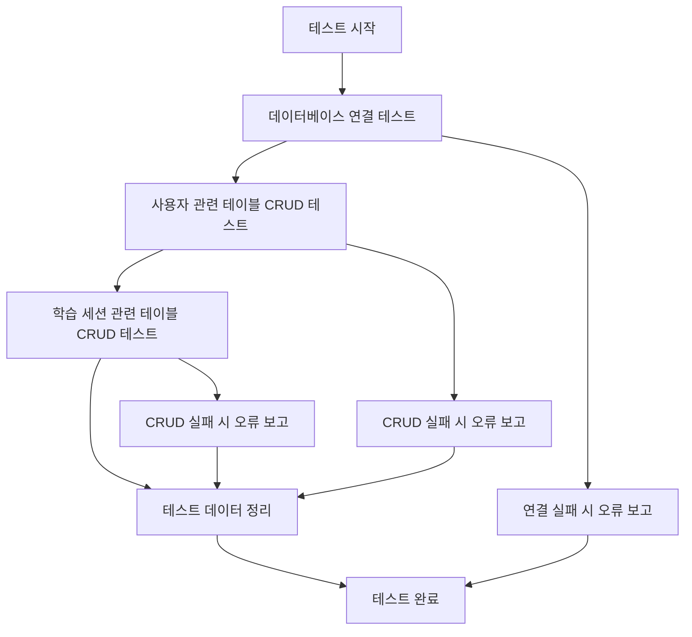

# 데이터베이스 연결 테스트 설계 문서

## 개요

이 설계는 AI 활용법 학습 튜터 프로젝트의 MySQL 데이터베이스 연결과 핵심 CRUD 작업을 검증하는 테스트 시스템을 구현합니다. 기존의 데이터베이스 연결 유틸리티를 활용하여 실제 운영 환경에서 데이터베이스 작업이 정상적으로 동작하는지 확인합니다.

## 아키텍처

### 테스트 구조

```
backend/tests/
├── test_database_connection.py     # 메인 테스트 파일
└── fixtures/
    └── test_data.py               # 테스트 데이터 정의
```

### 테스트 실행 흐름



## 컴포넌트 및 인터페이스

### 1. DatabaseConnectionTest 클래스

**역할**: 메인 테스트 클래스로 모든 데이터베이스 테스트를 관리

**주요 메서드**:
- `test_database_connection()`: 기본 연결 테스트
- `test_users_crud()`: 사용자 테이블 CRUD 테스트
- `test_user_progress_crud()`: 사용자 진행 상태 테이블 CRUD 테스트
- `test_user_statistics_crud()`: 사용자 통계 테이블 CRUD 테스트
- `test_learning_sessions_crud()`: 학습 세션 테이블 CRUD 테스트
- `test_session_conversations_crud()`: 세션 대화 테이블 CRUD 테스트
- `test_session_quizzes_crud()`: 세션 퀴즈 테이블 CRUD 테스트
- `cleanup_test_data()`: 테스트 데이터 정리

### 2. TestDataManager 클래스

**역할**: 테스트 데이터 생성 및 관리

**주요 메서드**:
- `create_test_user_data()`: 테스트 사용자 데이터 생성
- `create_test_user_progress_data()`: 테스트 사용자 진행 상태 데이터 생성
- `create_test_user_statistics_data()`: 테스트 사용자 통계 데이터 생성
- `create_test_session_data()`: 테스트 세션 데이터 생성
- `create_test_conversation_data()`: 테스트 대화 데이터 생성
- `create_test_quiz_data()`: 테스트 퀴즈 데이터 생성
- `cleanup_all_test_data()`: 모든 테스트 데이터 삭제

### 3. 기존 유틸리티 활용

**DatabaseConnection 클래스**: 기존 `backend/app/utils/database/connection.py`의 연결 관리 클래스 활용

**쿼리 실행 함수들**: 
- `execute_query()`: 기본 쿼리 실행
- `fetch_one()`: 단일 레코드 조회
- `fetch_all()`: 다중 레코드 조회

## 데이터 모델

### 테스트 사용자 데이터 구조

```python
test_user_data = {
    "login_id": "test_user_001",
    "username": "테스트사용자",
    "email": "test@example.com",
    "password_hash": "hashed_password_123",
    "user_type": "beginner",
    "diagnosis_completed": True
}
```

### 테스트 학습 세션 데이터 구조

```python
test_session_data = {
    "session_id": "user999_ch1_session001_20250808_120000",
    "user_id": 999,  # 테스트 사용자 ID
    "chapter_number": 1,
    "session_sequence": 1,
    "session_start_time": "2025-08-08 12:00:00",
    "session_end_time": "2025-08-08 12:30:00",
    "study_duration_minutes": 30,
    "session_decision_result": "proceed"
}
```

## 오류 처리

### 연결 오류 처리

```python
try:
    db_conn = DatabaseConnection()
    connection = db_conn.connect()
    # 연결 성공 로직
except DatabaseConnectionError as e:
    # 연결 실패 처리
    logger.error(f"데이터베이스 연결 실패: {e}")
    return False
```

### CRUD 오류 처리

```python
try:
    result = execute_query(query, params, fetch_result=True)
    # CRUD 성공 로직
except DatabaseQueryError as e:
    # 쿼리 실행 실패 처리
    logger.error(f"CRUD 작업 실패: {e}")
    return False
except DatabaseIntegrityError as e:
    # 무결성 제약 위반 처리
    logger.error(f"데이터 무결성 오류: {e}")
    return False
```

### 테스트 데이터 정리 보장

```python
def cleanup_test_data(self):
    """테스트 실패 시에도 데이터 정리 보장"""
    try:
        # 의존성 순서에 따른 삭제
        self._delete_test_conversations()
        self._delete_test_quizzes()
        self._delete_test_sessions()
        self._delete_test_user_statistics()
        self._delete_test_user_progress()
        self._delete_test_users()
    except Exception as e:
        logger.warning(f"테스트 데이터 정리 중 오류: {e}")
        # 강제 정리 시도
        self._force_cleanup()
```

## 테스트 전략

### 1. 연결 테스트

**목적**: MySQL 서버 연결 상태 확인

**테스트 항목**:
- 정상 연결 성공 여부
- 연결 상태 확인 (`is_connected()`)
- 연결 해제 정상 동작
- 재연결 기능 동작

### 2. 사용자 관련 테이블 CRUD 테스트

#### 2.1 users 테이블 테스트
**Create 테스트**:
- 새 사용자 레코드 삽입
- 중복 login_id 처리 확인
- 필수 필드 누락 시 오류 처리

**Read 테스트**:
- login_id로 사용자 조회
- 존재하지 않는 사용자 조회 시 None 반환
- 사용자 목록 조회

**Update 테스트**:
- 사용자 정보 수정 (username, user_type 등)
- 존재하지 않는 사용자 수정 시 처리

**Delete 테스트**:
- 사용자 삭제
- 존재하지 않는 사용자 삭제 시 처리

#### 2.2 user_progress 테이블 테스트
**Create 테스트**:
- 새 사용자 진행 상태 레코드 삽입
- 외래키 제약 조건 확인 (user_id)

**Read 테스트**:
- 사용자별 진행 상태 조회
- 현재 챕터 정보 조회

**Update 테스트**:
- 현재 챕터 업데이트
- 마지막 학습 날짜 업데이트

**Delete 테스트**:
- 진행 상태 삭제

#### 2.3 user_statistics 테이블 테스트
**Create 테스트**:
- 새 사용자 통계 레코드 삽입
- 기본값 설정 확인

**Read 테스트**:
- 사용자별 통계 조회
- 학습 시간 및 정답률 조회

**Update 테스트**:
- 학습 통계 업데이트
- 평균 정답률 계산 확인

**Delete 테스트**:
- 통계 데이터 삭제

### 3. 학습 세션 관련 테이블 CRUD 테스트

#### 3.1 learning_sessions 테이블 테스트
**Create 테스트**:
- 새 학습 세션 레코드 삽입
- 외래키 제약 조건 확인 (user_id)
- 세션 ID 중복 처리

**Read 테스트**:
- 세션 ID로 세션 조회
- 사용자별 세션 목록 조회
- 챕터별 세션 조회

**Update 테스트**:
- 세션 상태 업데이트 (session_decision_result)
- 세션 종료 시간 업데이트

**Delete 테스트**:
- 세션 삭제
- 연관 데이터 정리 확인

#### 3.2 session_conversations 테이블 테스트
**Create 테스트**:
- 새 대화 레코드 삽입
- 외래키 제약 조건 확인 (session_id)
- 메시지 순서 관리

**Read 테스트**:
- 세션별 대화 목록 조회
- 메시지 순서별 조회
- 에이전트별 메시지 조회

**Update 테스트**:
- 메시지 내용 수정
- 세션 진행 단계 업데이트

**Delete 테스트**:
- 대화 레코드 삭제

#### 3.3 session_quizzes 테이블 테스트
**Create 테스트**:
- 새 퀴즈 레코드 삽입
- 외래키 제약 조건 확인 (session_id)
- 문제 유형별 데이터 삽입

**Read 테스트**:
- 세션별 퀴즈 조회
- 문제 유형별 조회
- 정답률 통계 조회

**Update 테스트**:
- 사용자 답변 업데이트
- 평가 결과 업데이트

**Delete 테스트**:
- 퀴즈 레코드 삭제

### 4. 데이터 정리 테스트

**정상 정리 테스트**:
- 모든 테스트 데이터 완전 삭제 확인
- 의존성 순서 준수 (세션 → 사용자)

**실패 시 정리 테스트**:
- 부분 실패 시에도 정리 완료
- 강제 정리 메커니즘 동작

## 성능 고려사항

### 빠른 테스트 실행

- **순차 실행**: 데이터베이스 테스트는 순차 실행으로 단순화
- **최소 데이터**: 테스트에 필요한 최소한의 데이터만 생성
- **기본 연결 관리**: 연결 생성/해제만 기본적으로 관리

## 보안 고려사항

### 테스트 환경 분리

- **테스트 전용 데이터베이스**: 운영 데이터와 완전 분리
- **테스트 계정**: 제한된 권한의 테스트 전용 계정 사용
- **환경변수**: 테스트 환경 설정은 별도 환경변수로 관리

### 민감 정보 보호

- **비밀번호**: 테스트용 더미 해시값 사용
- **개인정보**: 실제 개인정보와 유사하지 않은 테스트 데이터 사용
- **로그 보안**: 민감 정보가 로그에 노출되지 않도록 주의

## 모니터링 및 로깅

### 테스트 결과 로깅

```python
# 테스트 성공 시
logger.info(f"✅ {test_name} 테스트 성공: {result}")

# 테스트 실패 시  
logger.error(f"❌ {test_name} 테스트 실패: {error_message}")

# 테스트 진행 상황
logger.debug(f"🔄 {test_name} 테스트 진행 중...")
```

### 기본 실행 결과 로깅

- **테스트 성공/실패**: 각 테스트의 성공/실패 여부만 기록
- **오류 메시지**: 실패 시 간단한 오류 메시지 출력

## 확장성

### 추가 테이블 테스트

현재 설계는 다음 테이블들로 쉽게 확장 가능:
- `user_auth_tokens` 테이블 CRUD 테스트
- `chapters` 테이블 CRUD 테스트 (추후 구현 시)

### 빠른 기본 테스트 중심

이 설계는 복잡한 고급 테스트 시나리오는 제외하고, 데이터베이스가 정상적으로 작동하는지 확인하는 빠른 기본 테스트에만 집중합니다:
- 기본 연결/해제 테스트
- 각 테이블의 기본 CRUD 작업 테스트
- 간단한 외래키 제약 조건 확인
- 테스트 데이터 정리