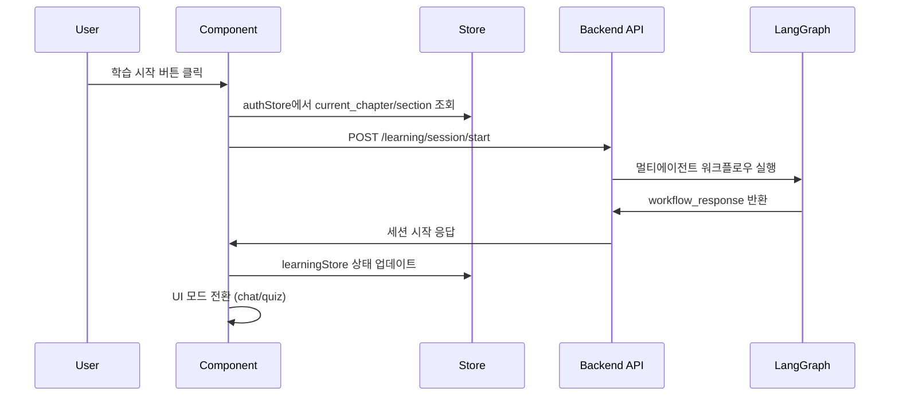

# 프론트엔드 API 연동 설계 문서

## 개요

현재 데모 데이터로 구현된 프론트엔드 학습 시스템을 실제 백엔드 API와 연동하여 완전한 학습 플랫폼을 구현합니다. 기존 컴포넌트 구조와 디자인을 유지하면서 API 연동 로직만 추가합니다.

## 아키텍처

### 전체 구조

```
Frontend (Vue 3)
├── Components (기존 유지)
│   ├── LearningPage.vue
│   ├── MainContentArea.vue
│   ├── ChatInteraction.vue
│   └── QuizInteraction.vue
├── Stores (Pinia)
│   ├── learningStore.js (tutorStore.js 내용 이전)
│   └── authStore.js (기존)
├── Services (신규/수정)
│   ├── learningService.js (수정)
│   └── api.js (기존)
└── Backend API
    └── LangGraph 멀티에이전트 시스템
```

### API 연동 흐름



## 컴포넌트 및 인터페이스

### 1. LearningPage.vue 수정사항

**기존 기능 유지:**
- 전체 레이아웃 구조
- MainContentArea와 ChatInteraction/QuizInteraction 배치
- 진행 상태 표시

**추가 기능:**
- 세션 시작 API 호출 로직
- 라우터 파라미터에서 챕터/섹션 정보 추출
- API 응답에 따른 초기 상태 설정

```javascript
// LearningPage.vue - 추가될 메서드
async mounted() {
  // 라우터 파라미터 또는 authStore에서 챕터/섹션 정보 가져오기
  const chapter = this.$route.params.chapter || this.authStore.currentChapter
  const section = this.$route.params.section || this.authStore.currentSection
  
  // 세션 시작 API 호출
  await this.startLearningSession(chapter, section)
}

async startLearningSession(chapter, section) {
  try {
    const response = await learningService.startSession({
      chapter_number: chapter,
      section_number: section,
      user_message: `${chapter}챕터 ${section}섹션 시작`
    })
    
    if (response.success) {
      // learningStore 상태 업데이트
      this.learningStore.updateWorkflowResponse(response.data.workflow_response)
      this.learningStore.updateSessionInfo(response.data.session_info)
    }
  } catch (error) {
    // 오류 처리
    this.showError(error.message)
  }
}
```

### 2. MainContentArea.vue 수정사항

**기존 기능 유지:**
- 에이전트별 컨텐츠 표시
- 테마 색상 적용
- 진행 상태 네비게이션

**추가 기능:**
- API 응답 데이터 기반 컨텐츠 렌더링
- 동적 컨텐츠 타입 처리 (theory, quiz, qna, feedback)

```javascript
// MainContentArea.vue - 컴퓨티드 속성 수정
computed: {
  currentContent() {
    const workflowResponse = this.learningStore.lastWorkflowResponse
    const content = workflowResponse.content || {}
    
    return {
      type: content.type || 'theory',
      title: content.title || '',
      content: content.content || '',
      keyPoints: content.key_points || [],
      examples: content.examples || []
    }
  }
}
```

### 3. ChatInteraction.vue 수정사항

**기존 기능 유지:**
- 채팅 UI 및 메시지 표시
- 자동 스크롤
- 메시지 타입별 스타일링

**추가 기능:**
- 실제 메시지 전송 API 호출
- 로딩 상태 표시
- API 응답에 따른 UI 모드 전환

```javascript
// ChatInteraction.vue - 메시지 전송 메서드
async sendMessage() {
  if (!this.newMessage.trim()) return
  
  // 사용자 메시지 추가
  this.learningStore.addChatMessage({
    sender: '사용자',
    message: this.newMessage,
    type: 'user'
  })
  
  const userMessage = this.newMessage
  this.newMessage = ''
  this.isLoading = true
  
  try {
    const response = await learningService.sendMessage({
      user_message: userMessage,
      message_type: 'user'
    })
    
    if (response.success) {
      // 워크플로우 응답 처리
      this.learningStore.updateWorkflowResponse(response.data.workflow_response)
      
      // AI 응답 메시지 추가
      this.learningStore.addChatMessage({
        sender: '튜터',
        message: this.extractMessageFromContent(response.data.workflow_response.content),
        type: 'system'
      })
    }
  } catch (error) {
    this.showError(error.message)
  } finally {
    this.isLoading = false
  }
}
```

### 4. QuizInteraction.vue 수정사항

**기존 기능 유지:**
- 퀴즈 UI (객관식/주관식)
- 힌트 시스템
- 답변 제출 폼

**추가 기능:**
- 퀴즈 답변 제출 API 호출
- 평가 결과 표시
- 다음 단계 선택 UI

```javascript
// QuizInteraction.vue - 답변 제출 메서드
async submitAnswer() {
  if (!this.selectedAnswer && !this.textAnswer) return
  
  const userAnswer = this.quizData.type === 'multiple_choice' 
    ? this.selectedAnswer 
    : this.textAnswer
  
  this.isSubmitting = true
  
  try {
    const response = await learningService.submitQuizAnswer({
      user_answer: userAnswer
    })
    
    if (response.success) {
      // 평가 결과 처리
      const evaluation = response.data.workflow_response.evaluation_result
      this.showEvaluationResult(evaluation)
      
      // 워크플로우 응답 업데이트
      this.learningStore.updateWorkflowResponse(response.data.workflow_response)
    }
  } catch (error) {
    this.showError(error.message)
  } finally {
    this.isSubmitting = false
  }
}

showEvaluationResult(evaluation) {
  // 평가 결과 표시 및 다음 단계 선택 UI 표시
  this.evaluationResult = evaluation
  this.showNextStepOptions = true
}
```

## 데이터 모델

### LearningStore 상태 구조

```javascript
// learningStore.js - tutorStore.js 내용 이전 및 API 연동을 위한 상태 추가
state: {
  // 기존 상태 유지
  currentAgent: 'theory_educator',
  currentUIMode: 'chat',
  sessionProgressStage: 'session_start',
  
  // API 연동 관련 추가 상태
  isLoading: false,
  error: null,
  sessionId: null,
  
  // 워크플로우 응답 캐시
  lastWorkflowResponse: {
    current_agent: null,
    session_progress_stage: null,
    ui_mode: null,
    content: {},
    evaluation_result: null,
    session_completion: null
  }
}
```

### API 응답 데이터 매핑

```javascript
// API 응답을 Store 상태로 매핑하는 헬퍼 함수
const mapWorkflowResponseToStore = (workflowResponse) => {
  return {
    currentAgent: workflowResponse.current_agent,
    currentUIMode: workflowResponse.ui_mode,
    sessionProgressStage: workflowResponse.session_progress_stage,
    
    // 컨텐츠 타입별 데이터 매핑
    mainContent: mapContentByType(workflowResponse.content),
    quizData: mapQuizData(workflowResponse.content),
    evaluationResult: workflowResponse.evaluation_result,
    sessionCompletion: workflowResponse.session_completion
  }
}
```

## 오류 처리

### 오류 타입별 처리 전략

```javascript
// 오류 처리 유틸리티
const handleApiError = (error, context) => {
  const errorMessage = error.response?.data?.error?.message || error.message
  
  // 사용자에게 표시할 오류 메시지
  const userMessage = {
    'NETWORK_ERROR': '네트워크 연결을 확인해주세요.',
    'TOKEN_EXPIRED': '로그인이 만료되었습니다. 다시 로그인해주세요.',
    'SESSION_NOT_FOUND': '세션을 찾을 수 없습니다. 새로 시작해주세요.',
    'VALIDATION_ERROR': '입력값을 확인해주세요.',
    'SERVER_ERROR': '서버 오류가 발생했습니다. 잠시 후 다시 시도해주세요.'
  }[error.code] || errorMessage
  
  // 컨텍스트별 추가 처리
  if (context === 'session_start' && error.code === 'CHAPTER_ACCESS_DENIED') {
    // 대시보드로 리다이렉트
    router.push('/dashboard')
  }
  
  return userMessage
}
```

## 테스팅 전략

### 단위 테스트

```javascript
// learningService.test.js
describe('learningService', () => {
  test('세션 시작 API 호출', async () => {
    const mockResponse = {
      success: true,
      data: {
        session_info: { chapter_number: 1, section_number: 1 },
        workflow_response: { current_agent: 'theory_educator' }
      }
    }
    
    apiClient.post.mockResolvedValue({ data: mockResponse })
    
    const result = await learningService.startSession({
      chapter_number: 1,
      section_number: 1
    })
    
    expect(result.success).toBe(true)
    expect(result.data.workflow_response.current_agent).toBe('theory_educator')
  })
})
```

### 통합 테스트

```javascript
// LearningPage.integration.test.js
describe('LearningPage 통합 테스트', () => {
  test('세션 시작부터 완료까지 전체 플로우', async () => {
    // 1. 세션 시작
    await wrapper.vm.startLearningSession(1, 1)
    expect(learningStore.currentAgent).toBe('theory_educator')
    
    // 2. 메시지 전송
    await wrapper.vm.sendMessage('다음 단계로 가주세요')
    expect(learningStore.currentUIMode).toBe('quiz')
    
    // 3. 퀴즈 답변
    await wrapper.vm.submitQuizAnswer('2')
    expect(learningStore.sessionProgressStage).toBe('quiz_and_feedback_completed')
    
    // 4. 세션 완료
    await wrapper.vm.completeSession('proceed')
    expect(learningStore.sessionCompletion).toBeDefined()
  })
})
```


## 보안 고려사항

### 1. 토큰 관리

```javascript
// API 요청 시 자동 토큰 첨부
apiClient.interceptors.request.use((config) => {
  const token = tokenManager.getAccessToken()
  if (token) {
    config.headers.Authorization = `Bearer ${token}`
  }
  return config
})

// 토큰 만료 시 자동 갱신
apiClient.interceptors.response.use(
  (response) => response,
  async (error) => {
    if (error.response?.status === 401) {
      await authStore.refreshTokens()
      return apiClient.request(error.config)
    }
    return Promise.reject(error)
  }
)
```

### 2. 입력값 검증

```javascript
// 사용자 입력 검증
const validateUserInput = (input) => {
  // XSS 방지
  const sanitized = DOMPurify.sanitize(input)
  
  // 길이 제한
  if (sanitized.length > 1000) {
    throw new Error('메시지가 너무 깁니다.')
  }
  
  return sanitized
}
```

## 모니터링 및 로깅

### 사용자 행동 추적

```javascript
// 학습 진행 상황 로깅
const logLearningEvent = (eventType, data) => {
  console.log(`[Learning Event] ${eventType}:`, {
    timestamp: new Date().toISOString(),
    userId: authStore.userId,
    chapter: learningStore.sessionInfo.chapter_number,
    section: learningStore.sessionInfo.section_number,
    ...data
  })
}

// 사용 예시
logLearningEvent('SESSION_START', { chapter: 1, section: 1 })
logLearningEvent('QUIZ_SUBMIT', { answer: '2', correct: true })
logLearningEvent('SESSION_COMPLETE', { decision: 'proceed' })
```