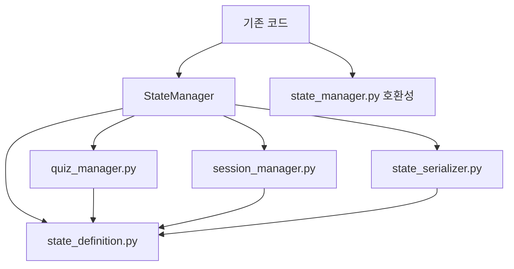

# Design Document

## Overview

현재 600줄의 `state_manager.py` 파일을 4개의 독립적인 모듈로 분리하여 코드 가독성과 유지보수성을 향상시킵니다. 기존 인터페이스는 그대로 유지하면서 내부 구조만 개선하는 리팩토링 작업입니다.

## Architecture

### 현재 구조
```
backend/app/core/langraph/
├── state_manager.py (600줄)
└── ...
```

### 목표 구조
```
backend/app/core/langraph/
├── state_manager.py (기존 호환성 유지용)
├── state/
│   ├── __init__.py (통합 인터페이스)
│   ├── state_definition.py (TutorState 정의)
│   ├── quiz_manager.py (퀴즈 관련 로직)
│   ├── session_manager.py (세션 관리 로직)
│   └── state_serializer.py (직렬화/검증)
└── ...
```

## Components and Interfaces

### 1. state_definition.py
**책임**: TutorState TypedDict 정의 및 기본 상수
```python
# 포함할 내용:
- TutorState TypedDict 클래스
- 기본 상수 (valid_user_types, valid_progress_stages 등)
- 필드별 문서화 주석
```

### 2. quiz_manager.py
**책임**: 퀴즈 관련 모든 로직 처리
```python
# 포함할 메서드:
- update_quiz_info()
- parse_quiz_from_json()
- update_evaluation_result()
- clear_quiz_data()
- get_quiz_type_from_section()
- update_quiz_type_from_section()
- sync_quiz_types()
- update_user_answer()
```

### 3. session_manager.py
**책임**: 세션 및 에이전트 관리 로직
```python
# 포함할 메서드:
- update_section_progress()
- update_agent_transition()
- update_session_progress()
- update_ui_mode()
- reset_session_state()
- add_conversation()
- clear_agent_drafts()
- update_agent_draft()
- update_session_decision()
- prepare_next_session()
- get_current_section_data()
```

### 4. state_serializer.py
**책임**: State 직렬화, 복원, 유효성 검증
```python
# 포함할 메서드:
- to_dict()
- from_dict()
- validate_state()
```

### 5. __init__.py (통합 인터페이스)
**책임**: 모든 분리된 모듈을 통합하는 StateManager 클래스 제공
```python
# StateManager 클래스:
- 기존 모든 메서드 인터페이스 유지
- 내부적으로 분리된 모듈들을 조합하여 동작
- 기존 코드와 100% 호환성 보장
```

## Data Models

### TutorState 구조 (변경 없음)
기존 TutorState의 모든 필드와 타입을 그대로 유지합니다:
- 기본 사용자 정보 (user_id, user_type)
- 학습 진행 상태 (current_chapter, current_section, current_agent)
- 퀴즈 관련 정보 (quiz_type, quiz_content, quiz_options 등)
- 에이전트 대본 저장 (theory_draft, quiz_draft 등)
- 세션 제어 및 대화 관리

### 모듈 간 의존성


## Error Handling

### 모듈 분리 시 오류 처리
1. **Import 오류**: 기존 import 경로가 실패할 경우 새로운 경로로 fallback
2. **메서드 호출 오류**: 분리된 모듈에서 메서드를 찾을 수 없는 경우 적절한 에러 메시지 제공
3. **타입 검증 오류**: TutorState 타입이 일치하지 않는 경우 명확한 오류 메시지

### 호환성 보장 전략
```python
# state_manager.py (기존 파일)
try:
    from .state import StateManager, TutorState, state_manager
except ImportError:
    # 기존 구현 유지 (fallback)
    pass
```

## Testing Strategy

### 테스트 접근 방식
1. **기존 테스트 유지**: `backend/tests/0812/test_state_manager.py`가 그대로 통과해야 함
2. **모듈별 단위 테스트**: 각 분리된 모듈에 대한 개별 테스트 작성
3. **통합 테스트**: StateManager 클래스의 전체 기능 테스트

### 테스트 파일 구조
```
backend/tests/0817/
├── test_state_refactoring.py (통합 테스트)
├── test_quiz_manager.py (퀴즈 모듈 테스트)
├── test_session_manager.py (세션 모듈 테스트)
└── test_state_serializer.py (직렬화 모듈 테스트)
```

## Implementation Phases

### Phase 1: 폴더 구조 생성
- `backend/app/core/langraph/state/` 폴더 생성
- 빈 파일들 생성 (state_definition.py, quiz_manager.py 등)

### Phase 2: 코드 분리
- TutorState를 state_definition.py로 이동
- 퀴즈 관련 메서드를 quiz_manager.py로 이동
- 세션 관련 메서드를 session_manager.py로 이동
- 직렬화 메서드를 state_serializer.py로 이동

### Phase 3: 통합 인터페이스 구현
- __init__.py에서 StateManager 클래스 재구성
- 기존 인터페이스와 동일한 메서드 제공
- 내부적으로 분리된 모듈들 활용

### Phase 4: 호환성 확보
- 기존 state_manager.py 파일 수정
- 새로운 모듈 구조로 import 경로 업데이트
- 기존 테스트 실행하여 호환성 검증