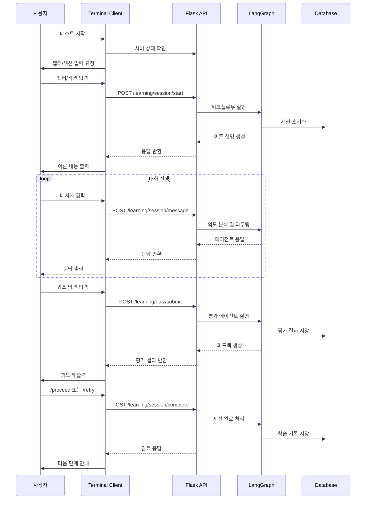

# Design Document

## Overview

터미널 기반 백엔드 멀티에이전트 시스템 테스트 도구는 AI Skill Tutor 프로젝트의 Flask 백엔드와 LangGraph 워크플로우를 프론트엔드 없이 직접 테스트할 수 있는 대화형 CLI 애플리케이션입니다. 이 도구는 실제 사용자 경험을 시뮬레이션하면서 개발자가 백엔드 로직을 검증하고 디버깅할 수 있게 해줍니다.

## Architecture

### System Architecture

```
┌─────────────────────────────────────────────────────────────┐
│                Terminal Test Client                          │
├─────────────────────────────────────────────────────────────┤
│  ┌─────────────────┐  ┌─────────────────┐  ┌──────────────┐ │
│  │  Input Handler  │  │  Command Parser │  │ State Monitor│ │
│  └─────────────────┘  └─────────────────┘  └──────────────┘ │
│  ┌─────────────────┐  ┌─────────────────┐  ┌──────────────┐ │
│  │ Response Display│  │  API Client     │  │ Log Manager  │ │
│  └─────────────────┘  └─────────────────┘  └──────────────┘ │
├─────────────────────────────────────────────────────────────┤
│                    HTTP API Layer                           │
├─────────────────────────────────────────────────────────────┤
│                Flask Backend Server                         │
│  ┌─────────────────┐  ┌─────────────────┐  ┌──────────────┐ │
│  │ Learning Routes │  │ LangGraph Flow  │  │ Session Mgmt │ │
│  └─────────────────┘  └─────────────────┘  └──────────────┘ │
└─────────────────────────────────────────────────────────────┘
```

### Component Interaction Flow



## Components and Interfaces

### 1. Terminal Test Client

**역할**: 사용자 인터페이스 및 전체 테스트 플로우 제어

**주요 클래스**:
```python
class TerminalTester:
    def __init__(self):
        self.api_client = APIClient()
        self.command_parser = CommandParser()
        self.state_monitor = StateMonitor()
        self.server_process = None
        
    def start_test_session(self) -> None
    def handle_user_input(self, user_input: str) -> None
    def display_response(self, response: dict) -> None
    def cleanup_and_exit(self) -> None
```

**인터페이스**:
- `start_backend_server()`: Flask 서버 자동 시작
- `get_user_input()`: 사용자 입력 처리
- `parse_special_commands()`: 특수 명령어 파싱 (/state, /quit 등)
- `display_formatted_output()`: 응답 내용 포맷팅 출력

### 2. API Client

**역할**: Flask 백엔드와의 HTTP 통신 관리

**주요 클래스**:
```python
class APIClient:
    def __init__(self, base_url: str = "http://localhost:5000/api/v1"):
        self.base_url = base_url
        self.session = requests.Session()
        self.jwt_token = None
        
    def start_learning_session(self, chapter: int, section: int, message: str) -> dict
    def send_message(self, message: str, message_type: str = "user") -> dict
    def submit_quiz_answer(self, answer: str) -> dict
    def complete_session(self, decision: str) -> dict
    def get_current_state(self) -> dict
```

**인터페이스**:
- `generate_test_jwt()`: 테스트용 JWT 토큰 생성
- `make_authenticated_request()`: 인증 헤더 포함 요청
- `handle_api_errors()`: API 오류 처리 및 로깅
- `log_request_response()`: 요청/응답 상세 로깅

### 3. Command Parser

**역할**: 사용자 입력 분석 및 적절한 API 엔드포인트 결정

**주요 클래스**:
```python
class CommandParser:
    SPECIAL_COMMANDS = {
        "/state": "get_current_state",
        "/quit": "exit_application", 
        "/exit": "exit_application",
        "/retry": "complete_session_retry",
        "/proceed": "complete_session_proceed"
    }
    
    def parse_input(self, user_input: str) -> CommandAction
    def is_special_command(self, input_text: str) -> bool
    def determine_api_endpoint(self, input_text: str, current_mode: str) -> str
```

**인터페이스**:
- `CommandAction`: 명령어 타입과 파라미터를 포함하는 데이터 클래스
- `parse_quiz_answer()`: 퀴즈 답변 형식 검증
- `extract_session_decision()`: proceed/retry 결정 추출

### 4. State Monitor

**역할**: TutorState 실시간 모니터링 및 시각화

**주요 클래스**:
```python
class StateMonitor:
    def __init__(self):
        self.previous_state = {}
        self.state_history = []
        
    def display_current_state(self, state: dict) -> None
    def highlight_state_changes(self, current_state: dict) -> None
    def format_state_display(self, state: dict) -> str
    def track_agent_transitions(self, state: dict) -> None
```

**인터페이스**:
- `format_key_fields()`: 핵심 필드 하이라이트 표시
- `show_agent_flow()`: 에이전트 전환 흐름 시각화
- `display_session_progress()`: 세션 진행 상태 표시

### 5. Server Manager

**역할**: Flask 백엔드 서버 생명주기 관리

**주요 클래스**:
```python
class ServerManager:
    def __init__(self, backend_path: str = "backend"):
        self.backend_path = backend_path
        self.server_process = None
        self.server_ready = False
        
    def start_server(self) -> bool
    def wait_for_server_ready(self, timeout: int = 30) -> bool
    def stop_server(self) -> None
    def check_server_health(self) -> bool
```

**인터페이스**:
- `activate_virtual_environment()`: 가상환경 활성화
- `run_flask_server()`: Flask 서버 실행
- `monitor_server_logs()`: 서버 로그 모니터링
- `graceful_shutdown()`: 안전한 서버 종료

## Data Models

### 1. Test Session State

```python
@dataclass
class TestSessionState:
    current_chapter: int
    current_section: int
    session_active: bool
    ui_mode: str  # "chat" or "quiz"
    current_agent: str
    session_progress_stage: str
    last_response: dict
    conversation_history: List[dict]
```

### 2. Command Action

```python
@dataclass
class CommandAction:
    action_type: str  # "api_call", "special_command", "exit"
    endpoint: str
    payload: dict
    requires_confirmation: bool = False
```

### 3. API Response Wrapper

```python
@dataclass
class APIResponse:
    success: bool
    status_code: int
    data: dict
    error_message: str = None
    execution_time: float = 0.0
```

## Error Handling

### 1. Server Connection Errors

**처리 전략**:
- 서버 시작 실패 시 상세 오류 메시지 출력
- 연결 타임아웃 시 재시도 로직 (최대 3회)
- 서버 프로세스 상태 모니터링

**구현**:
```python
def handle_server_connection_error(self, error: Exception) -> None:
    if isinstance(error, requests.ConnectionError):
        print("❌ 백엔드 서버에 연결할 수 없습니다.")
        print("서버 상태를 확인하고 다시 시도해주세요.")
        self.attempt_server_restart()
    elif isinstance(error, requests.Timeout):
        print("⏰ 서버 응답 시간이 초과되었습니다.")
        self.retry_with_longer_timeout()
```

### 2. API Response Errors

**처리 전략**:
- HTTP 상태 코드별 맞춤 오류 메시지
- LangGraph 워크플로우 오류 상세 분석
- 사용자 친화적 오류 설명 제공

**구현**:
```python
def handle_api_error(self, response: requests.Response) -> None:
    if response.status_code == 401:
        print("🔐 인증 오류: JWT 토큰을 재생성합니다.")
        self.regenerate_jwt_token()
    elif response.status_code == 500:
        error_data = response.json().get('error', {})
        if 'LANGCHAIN_ERROR' in error_data.get('code', ''):
            print("🤖 AI 처리 중 오류가 발생했습니다.")
            self.display_langchain_error_details(error_data)
```

### 3. Backend Error Handling

**처리 전략**:
- 백엔드 서버의 검증 오류 메시지 그대로 표시
- 사용자 친화적 오류 설명 추가
- 특수 명령어 파싱 오류만 클라이언트에서 처리

**구현**:
```python
def handle_backend_validation_error(self, error_response: dict) -> None:
    error_info = error_response.get('error', {})
    error_code = error_info.get('code', 'UNKNOWN_ERROR')
    error_message = error_info.get('message', '알 수 없는 오류가 발생했습니다.')
    
    print(f"❌ {error_message}")
    if error_code == 'VALIDATION_ERROR':
        print("💡 입력값을 다시 확인해주세요.")
```

## Testing Strategy

### 1. Unit Testing

**테스트 대상**:
- `CommandParser`: 입력 파싱 로직
- `APIClient`: HTTP 요청/응답 처리
- `StateMonitor`: 상태 변화 감지 및 표시
- `ServerManager`: 서버 생명주기 관리

**테스트 파일 위치**: `backend/tests/terminal_tester/`

### 2. Integration Testing

**테스트 시나리오**:
- 전체 학습 플로우 (이론 → 퀴즈 → 평가 → 완료)
- 에러 상황 처리 (서버 다운, API 오류)
- 특수 명령어 처리 (/state, /quit)
- 세션 상태 연속성 검증

### 3. Manual Testing Checklist

**기본 플로우**:
- [ ] 서버 자동 시작 및 LangGraph 구축 확인
- [ ] 챕터/섹션 입력 및 세션 시작
- [ ] 이론 설명 출력 및 다음 단계 진행
- [ ] 퀴즈 생성 및 답변 제출
- [ ] 평가 피드백 출력 및 세션 완료
- [ ] proceed/retry 결정에 따른 다음 단계 진행

**특수 기능**:
- [ ] `/state` 명령어로 TutorState 전체 출력
- [ ] 상태 변화 하이라이트 표시
- [ ] API 요청/응답 상세 로깅
- [ ] Ctrl+C 및 `/quit` 명령어로 안전한 종료

## Implementation Details

### 1. Project Structure

```
backend/tests/terminal_tester/
├── __init__.py
├── main.py                    # 메인 실행 파일
├── core/
│   ├── __init__.py
│   ├── terminal_tester.py     # 메인 테스터 클래스
│   ├── api_client.py          # API 통신 클래스
│   ├── command_parser.py      # 명령어 파싱 클래스
│   ├── state_monitor.py       # 상태 모니터링 클래스
│   └── server_manager.py      # 서버 관리 클래스
├── utils/
│   ├── __init__.py
│   ├── jwt_generator.py       # 테스트용 JWT 생성
│   └── formatters.py          # 출력 포맷팅 유틸
├── config/
│   ├── __init__.py
│   └── test_config.py         # 테스트 설정
└── README.md                  # 사용법 안내
```

### 2. Configuration Management

**테스트 설정**:
```python
# config/test_config.py
TEST_CONFIG = {
    "backend_path": "backend",
    "api_base_url": "http://localhost:5000/api/v1",
    "server_startup_timeout": 30,
    "api_request_timeout": 10,
    "default_user_type": "beginner",
    "jwt_secret": "test_secret_key_for_terminal_testing",
    "log_level": "INFO"
}
```

### 3. JWT Token Generation

**테스트용 토큰 생성**:
```python
def generate_test_jwt_token(user_id: int = 999, user_type: str = "beginner") -> str:
    payload = {
        "user_id": user_id,
        "login_id": f"test_user_{user_id}",
        "user_type": user_type,
        "exp": datetime.utcnow() + timedelta(hours=1),
        "iat": datetime.utcnow()
    }
    return jwt.encode(payload, TEST_CONFIG["jwt_secret"], algorithm="HS256")
```

### 4. Output Formatting

**응답 출력 포맷**:
```python
def format_ai_response(self, response_data: dict) -> str:
    content = response_data.get('workflow_response', {}).get('content', {})
    
    if content.get('type') == 'theory':
        return self.format_theory_content(content)
    elif content.get('type') == 'quiz':
        return self.format_quiz_content(content)
    elif content.get('type') == 'feedback':
        return self.format_feedback_content(content)
    else:
        return self.format_generic_content(content)
```

### 5. State Monitoring Display

**상태 출력 예시**:
```
=== 현재 TutorState 상태 ===
📍 학습 위치: 2챕터 1섹션
🤖 현재 에이전트: theory_educator
📊 진행 단계: theory_completed
🖥️  UI 모드: chat
⏱️  세션 시작: 2025-08-20 14:30:15
💬 대화 수: 3개

=== 변경된 필드 ===
✨ session_progress_stage: session_start → theory_completed
✨ current_agent: session_manager → theory_educator
```

## Security Considerations

### 1. Test Environment Isolation

- 테스트 전용 JWT 시크릿 키 사용
- 테스트 데이터베이스 분리 (test_ prefix)
- 프로덕션 환경 변수 격리

### 2. Input Sanitization

- 사용자 입력 XSS 방지 처리
- SQL Injection 방지 (파라미터화된 쿼리)
- 파일 경로 검증 (Directory Traversal 방지)

### 3. Resource Management

- 서버 프로세스 자동 정리
- 메모리 누수 방지
- 파일 핸들 적절한 해제

## Performance Considerations

### 1. Server Startup Optimization

- 가상환경 활성화 최적화
- Flask 서버 warm-up 시간 단축
- LangGraph 컴파일 시간 모니터링

### 2. API Response Caching

- 반복적인 상태 조회 캐싱
- JWT 토큰 재사용
- 서버 헬스체크 결과 캐싱

### 3. Memory Management

- 대화 히스토리 크기 제한
- 로그 파일 크기 관리
- 상태 히스토리 순환 버퍼 사용

## Deployment and Usage

### 1. Installation Requirements

```bash
# 가상환경 활성화 (Windows)
cd backend
python -m venv venv
venv\Scripts\activate

# 의존성 설치
pip install -r requirements.txt

# 테스트 도구 실행
python tests/terminal_tester/main.py
```

### 2. Usage Flow

1. **테스트 시작**: `python main.py` 실행
2. **서버 대기**: "백엔드 서버가 실행되었습니다" 메시지 확인
3. **챕터 입력**: 1-8 사이 숫자 입력
4. **섹션 입력**: 1 이상 숫자 입력
5. **학습 진행**: 메시지 입력으로 AI와 상호작용
6. **상태 확인**: `/state` 명령어로 현재 상태 조회
7. **세션 완료**: `/proceed` 또는 `/retry`로 다음 단계 결정
8. **테스트 종료**: `/quit` 또는 Ctrl+C로 안전한 종료

### 3. Troubleshooting Guide

**일반적인 문제**:
- 서버 시작 실패 → 포트 5000 사용 여부 확인
- JWT 토큰 오류 → 테스트 시크릿 키 설정 확인
- LangGraph 오류 → OpenAI API 키 환경변수 확인
- 데이터베이스 연결 오류 → MySQL 서버 상태 확인