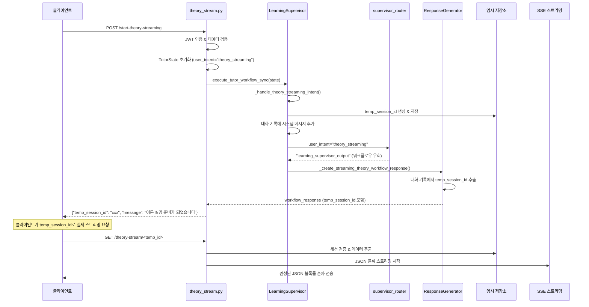

# 이론 생성 스트리밍 기능 설계 문서

## 개요

이론 생성 스트리밍 기능은 사용자가 특정 챕터의 이론 학습을 요청할 때, TheoryEducator Agent가 생성하는 이론 설명을 JSON 블록 단위로 실시간 스트리밍하는 시스템입니다. QnA 스트리밍과 유사한 아키텍처를 가지지만, 텍스트 토큰이 아닌 완성된 JSON 섹션 단위로 전송하는 것이 핵심 차이점입니다.

## 아키텍처

### 전체 시스템 흐름



### 핵심 컴포넌트

#### 1. theory_stream.py (메인 엔드포인트)
- POST /start-theory-streaming: 스트리밍 세션 시작
- GET /theory-stream/<temp_id>: SSE 스트리밍 실행
- 독립적인 세션 관리 및 TutorState 초기화

#### 2. LearningSupervisor 확장
- _handle_theory_streaming_intent() 메서드 추가
- 임시 세션 생성 및 대화 기록 관리
- 기존 TutorState 구조 유지

#### 3. ResponseGenerator 확장
- _create_streaming_theory_workflow_response() 메서드 추가
- 대화 기록에서 temp_session_id 추출
- 스트리밍 응답 메타데이터 생성

#### 4. supervisor_router 수정
- theory_streaming 의도 감지 시 워크플로우 우회
- "learning_supervisor_output" 반환

## 컴포넌트 및 인터페이스

### 1. theory_stream.py 구조

```python
# 엔드포인트 구조
@theory_stream_bp.route('/start-theory-streaming', methods=['POST'])
@require_auth
def start_theory_streaming():
    """이론 스트리밍 세션 시작"""
    # 1. JWT 인증 & 사용자 정보 추출
    # 2. 요청 데이터 검증 (chapter_number, section_number, user_message)
    # 3. 학습 권한 검증
    # 4. TutorState 초기화
    # 5. 워크플로우 실행
    # 6. temp_session_id 추출 & 응답

@theory_stream_bp.route('/theory-stream/<temp_id>', methods=['GET'])
def stream_theory_response(temp_id: str):
    """이론 JSON 블록 스트리밍"""
    # 1. 세션 검증
    # 2. TheoryEducator 초기화
    # 3. JSON 블록 스트리밍 시작
    # 4. 완료 후 리소스 정리

# 헬퍼 함수들
def _start_theory_streaming_session(token, chapter_number, section_number, user_message):
    """세션 시작 로직"""

def _generate_theory_json_stream(session_data):
    """JSON 블록 스트리밍 Generator"""
```

### 2. LearningSupervisor 확장

```python
def _handle_theory_streaming_intent(self, state: TutorState) -> TutorState:
    """이론 스트리밍 의도 처리"""
    # 1. temp_session_id 생성 (UUID)
    # 2. 임시 세션 데이터 저장
    # 3. 대화 기록에 시스템 메시지 추가
    # 4. state 업데이트 후 반환
```

### 3. ResponseGenerator 확장

```python
def _create_streaming_theory_workflow_response(self, state: TutorState) -> Dict[str, Any]:
    """이론 스트리밍 응답 생성"""
    # 1. 대화 기록에서 temp_session_id 추출
    # 2. workflow_response 구조 생성
    # 3. 스트리밍 메타데이터 포함
```

### 4. 임시 세션 저장소

```python
# 전역 저장소 구조
theory_streaming_sessions: Dict[str, Dict[str, Any]] = {
    "temp_session_id": {
        "user_id": int,
        "chapter_number": int,
        "section_number": int,
        "user_message": str,
        "context": Dict[str, Any],
        "created_at": float,
        "expires_at": float
    }
}
```

## 데이터 모델

### 요청/응답 구조

#### POST /start-theory-streaming 요청
```json
{
    "chapter_number": 1,
    "section_number": 1,
    "user_message": "AI의 기본 개념에 대해 설명해주세요"
}
```

#### POST /start-theory-streaming 응답
```json
{
    "success": true,
    "temp_session_id": "theory_stream_1234567890abcdef",
    "content": {
        "type": "streaming_theory",
        "message": "이론 설명 준비가 되었습니다.",
        "current_agent": "theory_educator"
    }
}
```

#### SSE 스트리밍 데이터 구조
```json
// 스트리밍 시작
{
    "type": "stream_start",
    "message": "이론 생성을 시작합니다...",
    "session_id": "theory_stream_xxx"
}

// JSON 블록 전송 (완성된 섹션)
{
    "type": "theory_block",
    "block_type": "introduction",
    "content": {
        "title": "AI 기본 개념",
        "description": "인공지능의 정의와 핵심 원리",
        "details": ["상세 설명 1", "상세 설명 2"]
    },
    "block_id": 1
}

// 스트리밍 완료
{
    "type": "stream_complete",
    "message": "이론 설명이 완성되었습니다.",
    "total_blocks": 5
}

// 에러 발생
{
    "type": "stream_error",
    "error_code": "THEORY_GENERATION_ERROR",
    "message": "이론 생성 중 오류가 발생했습니다."
}
```

### TutorState 구조 (기존 유지)

```python
# TypedDict 제약으로 인해 새 필드 추가 불가
# 기존 필드만 활용:
{
    "user_intent": "theory_streaming",  # 핵심 식별자
    "conversation": [...],  # temp_session_id가 시스템 메시지로 저장됨
    "current_chapter": int,
    "current_section": int,
    # ... 기타 기존 필드들
}
```

## 에러 처리

### 기본 에러 처리
- **인증 에러**: JWT 토큰 검증 실패 시 401 반환
- **데이터 검증 에러**: 필수 필드 누락 시 400 반환  
- **세션 에러**: 유효하지 않은 temp_session_id 시 404 반환
- **스트리밍 에러**: 생성 중 오류 발생 시 SSE 에러 이벤트 전송

## 테스트 전략

### 기본 기능 테스트

#### 1. theory_stream.py 테스트
```python
# backend/tests/0812/test_theory_stream.py
class TestTheoryStream:
    def test_start_theory_streaming_success(self):
        """정상적인 스트리밍 세션 시작 테스트"""
        
    def test_stream_theory_response_success(self):
        """정상적인 SSE 스트리밍 테스트"""
```

#### 2. 워크플로우 통합 테스트
```python
# backend/tests/0812/test_theory_streaming_integration.py
class TestTheoryStreamingIntegration:
    def test_full_theory_streaming_workflow(self):
        """POST → 워크플로우 → SSE 전체 흐름 테스트"""
```

