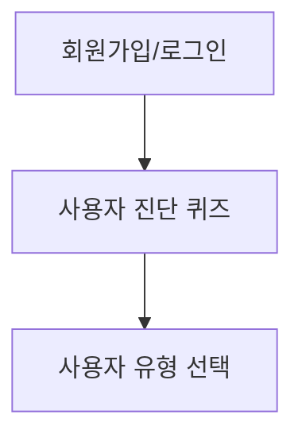
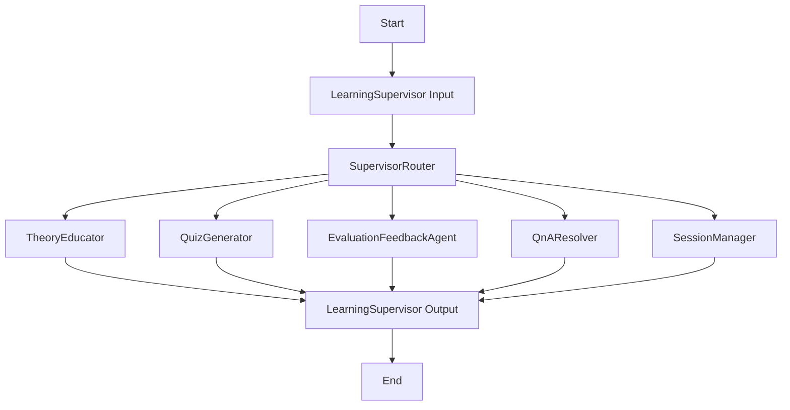

# 📄 AI 활용법 학습 튜터 (AI Skill Tutor) PRD v2.0

## 1. 🧭 개요

| 항목 | 내용 |
| --- | --- |
| 프로젝트명 | AI 활용법 학습 튜터 (AI Skill Tutor) |
| 목적 | 다양한 수준의 사용자가 AI(특히 LLM)를 이해하고 실용적으로 활용할 수 있도록 돕는 멀티에이전트 기반 튜터링 시스템 제공 |
| 대상 사용자 | ① AI 입문자 ② 실무 응용형 사용자 |
| 핵심 기능 | 사용자 진단 → 사용자 유형 선택 → 맞춤형 커리큘럼 진행 → 개념 학습 → 실습 및 평가 → 학습 기록 저장 |

---

## 2. 👣 사용자 흐름

### 2.1 최초 1회 온보딩



### 2.2 학습 진행 흐름



### 2.3 사용자 시나리오 (1학습 세션 흐름)

**개념 학습 → 문제 풀이 → 평가 완료**까지의 1학습 세션 예시:

```
1. 사용자: "1챕터 시작할게요" 
   → LearningSupervisor → TheoryEducator → LearningSupervisor 
   → 출력: "AI는 인간의 지능을 모방한 기술입니다..."

2. 사용자: "이해했어요, 다음 단계 해주세요"  
   → LearningSupervisor → QuizGenerator → LearningSupervisor
   → 출력: "다음 중 AI의 특징이 아닌 것은?"

3. 사용자: "2번이요" 
   → LearningSupervisor → EvaluationFeedbackAgent → 재학습 여부 판단 → LearningSupervisor 
   → 출력: "정답입니다! 다음 단계로 진행할까요?"

4. 사용자: "네" (최종 재학습 여부 판단은 사용자가) 
   → SessionManager가 세션을 마무리하고 DB에 데이터 저장 → LearningSupervisor 
   → 출력: "1챕터가 완료되었습니다"
```

**중간 질문 처리 예시:**
```
개념 설명 후 → 사용자: "AI와 머신러닝 차이가 뭐예요?"
→ LearningSupervisor → QnAResolver → LearningSupervisor
→ 출력: "AI는 더 넓은 개념이고..." → 다시 학습 진행
```

---

## 3. 🧑‍💻 기술 요구사항

### 백엔드

- **Python (Flask)**
    - REST API 서버
    - Blueprint 기반 구조화
- **MySQL 8.0** (PyMySQL 사용)
- **LangChain, LangGraph, LangSmith** 활용
- **ChromaDB 기반 벡터 데이터베이스** 연동

### 프론트엔드

- **Vue 3** (Vite + Composition API)
- **SCSS** (Nesting), Bootstrap 기반 UI
- **상태관리:** Pinia
- **HTTP 통신:** Axios
- **라우터:** vue-router
- **UI 모드 관리:** 자유 대화 ↔ 제한 UI 전환

### 기타

- **JWT 기반** 인증/인가
- **CORS 설정**
- **비밀번호 bcrypt** 암호화
- **실시간 AI API** 연동 (Gemini/GPT)

### 📦 사용 패키지 버전

- langchain==0.3.27
- langchain-core==0.3.72
- langgraph==0.6.3
- langsmith==0.4.13

---

## 4. 👥 사용자 유형별 학습 경로 (구체화)

### 4.1 사용자 진단 문항 구성 (5-7문)

**진단 항목:**
1. **AI 사용 경험** - ChatGPT 등 AI 도구 사용 경험 여부
2. **학습 목적** - 업무 효율성 vs 호기심 vs 자기계발 등
3. **업무 특성** - 문서작업 중심 vs 소통 중심 vs 분석 업무 등
4. **AI 관심도** - AI 관련 뉴스/정보 접촉 정도

### 4.2 🧠 AI 입문자 (beginner)

**타겟 특성:**
* 업무에서 컴퓨터를 사용하는 일반 직장인 (학력 무관)
* 비전공자 기준: IT/컴퓨터공학/데이터사이언스 전공이 아님, 프로그래밍 경험 없음, AI/머신러닝 체계적 학습 경험 없음
* 복잡한 기술 용어보다는 직관적이고 쉬운 설명을 선호

**학습 목표:**
* AI와 LLM의 기본 개념 이해
* 프롬프트 작성의 기초 원리 습득
* ChatGPT 등 AI 도구의 기본적인 활용법 체득

**학습 시간:**
* 1회 학습시간: 15분 내외
* 총 학습시간: 15시간 (1학점 기준)
* 총 챕터: 8챕터
* ※ 8개 챕터 상세 내용은 부록에서 작성 예정

### 4.3 💼 실무 응용형 사용자 (advanced)

**타겟 특성:**
* 관련 학과 출신(컴퓨터공학, 전자공학, 정보통신 등) 또는 프로그래밍 교육(국비교육, 부트캠프 등) 이수자
* 직급 무관 일반 직장인
* 기술적 배경은 있지만 AI/머신러닝 전문 교육은 받지 않음
* 프로그래밍 개념과 논리적 사고에 익숙함
* 이론보다는 실용적이고 구체적인 활용법에 관심
* 시간 효율성을 중시하며 빠른 성과를 원함

**학습 목표:**
* AI 기술의 실무적 이해
* 고급 활용 기법 습득
* 업무 적용 및 최적화 능력

**학습 시간:**
* 1회 학습시간: 20-30분
* 총 학습시간: 20시간
* 총 챕터: 10챕터

**챕터 구성:**
* **기본 8챕터**: AI 입문자 주제 재활용, 설명 수준을 기술적 배경에 맞게 상향
* **추가 2챕터**:
   * 9챕터: 고급 프롬프트 엔지니어링 (Chain-of-Thought, Few-shot 등)
   * 10챕터: API 연동 및 자동화 (간단한 스크립트 작성, 워크플로우 구축)
* ※ 10개 챕터 상세 내용은 부록에서 작성 예정

### 4.4 사용자 유형별 차별화 요소

| 구분 | AI 입문자 | 실무 응용형 |
| --- | --- | --- |
| **설명 방식** | 단계별 상세 설명, 일상생활 비유 | 기술적 원리 중심, 논리적 구조화 |
| **예시 유형** | 일상생활 비유 | 실무 케이스, 코드 예제 |
| **실습 난이도** | 기초적 프롬프트 | 복합적 프롬프트, API 활용 |
| **피드백 스타일** | 격려 중심 | 개선점 및 최적화 방안 중심 |
| **진행 속도** | 느린 속도, 반복 학습 | 빠른 속도, 효율성 중시 |
| **평가 기준** | 이해도 중심 | 실용성 및 적용 가능성 중심 |

---

## 5. 📚 AI 입문자 학습 챕터 구성

**Chapter 1. AI는 무엇인가?**
- AI는 어떻게 우리 삶에 들어와 있을까?
- AI, 머신러닝, 딥러닝 - 관계 파헤치기
- LLM, 챗봇, 생성형 AI, GPT, 파라미터 - 핵심 용어 5분 정리
- 챗봇과 무엇을 할 수 있을까?

**Chapter 2. LLM이란 무엇인가**
- 딥러닝 빅뱅의 시작, 알렉스넷과 GPU (2012)
- 알파고 쇼크 (2016): 인공지능, 인간을 넘어서다
- 트랜스포머 논문 (2017): '주목'이 모든 것을 바꿨다
- 챗GPT 3.5 출시 (2022): 모두를 위한 AI 시대의 개막
- 그리고 현재 (2025년): 멀티모달 AI의 시대

**Chapter 3. 다양한 AI 챗봇들 소개**
- 챗GPT (OpenAI): AI 시대의 문을 연 선두주자
- 제미나이 (Google): 검색의 왕, AI로 날개를 달다
- 클로드 (Anthropic): 안전하고 인간적인 AI를 향하여
- 또 다른 선택지들: 한국형 & 특화 챗봇
- 무료? 유료? 무엇을 선택해야 할까?

**Chapter 4. 프롬프트란 무엇인가**
- 프롬프트, AI를 움직이는 주문
- 좋은 프롬프트의 3가지 기본 요소
- 이것만은 피하자! 나쁜 프롬프트 예시
- 실습: 나만의 첫 프롬프트 만들기

**Chapter 5. 좋은 프롬프트 작성법**
- 전문가로 변신시키는 '역할 부여'의 마법
- 찰떡같이 알아듣게 만드는 '구체적 조건' 제시하기
- 원하는 결과물을 얻는 '형식 지정' 방법
- 글자로 그림을? 이미지 생성 프롬프트 맛보기

**Chapter 6. ChatGPT로 할 수 있는 것들**
- 10분 걸릴 문서 요약, 10초 만에 끝내기
- 어색한 번역은 이제 그만! 똑똑한 AI 번역기
- 막막할 때, 아이디어 발전시키기
- 나만의 여행 계획, AI와 함께 짜기

**Chapter 7. AI와 함께하는 일상업무**
- 매일 쓰는 이메일, 3초 만에 작성하기
- 복잡한 엑셀 함수, AI에게 물어보기
- 회의록 정리, 이제 AI에게 맡기세요
- 나만의 업무 비서 만들기 (종합 실습)

**Chapter 8. AI 활용 고급 팁과 주의사항**
- AI의 가장 큰 함정: 환각 현상과 해결 방법
- AI에게 똑똑하게 생각시키는 법: CoT (Chain-of-Thought)
- AI를 24시간 개인 교사로 만드는 법: 챗봇과 함께 학습하기
- 우리가 던져야 할 질문들: AI 윤리 문제

---

## 6. 🤖 MAS 아키텍처 (멀티에이전트 시스템) - v2.0 업데이트

### 6.1 완성된 에이전트 구조

```
SessionManager (✅ 완성 - 세션 생명주기 관리, DB 저장)
└── LearningSupervisor (✅ 완성 - 워크플로우 시작점/끝점, 라우팅 및 응답 생성)
    ├── TheoryEducator (✅ 완성 - 이론 설명 대본 생성)
    ├── QuizGenerator (✅ 완성 - 퀴즈 및 힌트 동시 생성)
    ├── EvaluationFeedbackAgent (✅ 완성 - 객관식/주관식 통합 평가)
    └── QnAResolver (⚠️ 임시 구현 - "QnAResolver가 호출되었습니다" 메시지만 반환)
```

### 6.2 에이전트 상세 정보 (구현 완료 기준)

**SessionManager (완전 구현)**
- 역할: 세션 생명주기 관리, DB 저장, 챕터/섹션 자동 진행
- 구현 상태: ✅ 완성 - 실제 DB 연동 검증 100% 성공
- 주요 기능: learning_sessions, session_conversations, session_quizzes, user_progress 테이블 트랜잭션 기반 저장
- 진행 로직: `backend/data/chapters/chapter_01.json` 파일 기반 섹션 수 확인

**LearningSupervisor (완전 구현)**
- 역할: 워크플로우 시작점/끝점, 의도 분석 우회 로직, response_generator 통합
- 구현 상태: ✅ 완성 - 새로운 워크플로우 기반 핵심 에이전트
- 라우팅 최적화: 빠른 경로(완전 일치) + LLM 분석 2단계 시스템
- 주요 도구: intent_analysis_tools (25개 키워드 확장), response_generator

**TheoryEducator (완전 구현)**
- 역할: 특정 섹션 데이터만 로드하여 순수 이론 설명 대본 생성
- 구현 상태: ✅ 완성 - LangChain LCEL 파이프라인 전환
- 데이터 소스: JSON 파일 기반 섹션별 로드
- 체인 구성: `PromptTemplate | ChatOpenAI | StrOutputParser`

**QuizGenerator (완전 구현)**
- 역할: 퀴즈 및 힌트 동시 생성, JSON 출력 구조 최적화
- 구현 상태: ✅ 완성 - LangChain LCEL 파이프라인 + Pydantic 스키마
- 체인 구성: `PromptTemplate | ChatOpenAI | JsonOutputParser`
- 최적화: 1회 호출로 퀴즈+힌트 동시 처리

**EvaluationFeedbackAgent (완전 구현)**
- 역할: 객관식/주관식 통합 평가, ChatGPT 1회 호출로 채점+피드백 동시 처리
- 구현 상태: ✅ 완성 - 비용 최적화된 평가 시스템
- 평가 방식: 객관식(로컬 채점) + 주관식(ChatGPT 0-100점)
- 세션 관리: 최대 1회 재학습 제한, 60점 기준 proceed/retry 판단

**QnAResolver (임시 구현)**
- 역할: 실시간 질문 답변 (향후 구현 예정)
- 구현 상태: ⚠️ 임시 - "QnAResolver가 호출되었습니다" 메시지만 반환
- 예정 기능: Vector DB 검색, 웹 검색, 학습 관련성 판단
- LangGraph 노드 등록: 완료 (다른 에이전트 테스트 가능)

---

## 7. 🔧 Tool 시스템 - v2.0 업데이트

### 7.1 구현 완료된 Tool 목록

**✅ 컨텐츠 생성 Tools (LCEL 파이프라인 완성):**
- `theory_tools_chatgpt.py` - ChatOpenAI + StrOutputParser 기반 이론 설명
- `quiz_tools_chatgpt.py` - ChatOpenAI + JsonOutputParser + Pydantic 스키마 퀴즈 생성
- `feedback_tools_chatgpt.py` - ChatGPT 기반 피드백 생성 (1회 호출 최적화)

**✅ 분석/평가 Tools (완전 구현):**
- `evaluation_tools.py` - 로컬 객관식 채점 시스템
- `intent_analysis_tools.py` - 의도 분석 (25개 키워드 + LLM 분석)

**✅ 세션 관리 Tools (DB 연동 완성):**
- `session_handlers.py` - DB 저장 및 통계 관리, 완전한 예외 처리
- `session_manager_agent.py` - 섹션 번호 기반 ID 생성

**⚠️ 미구현 Tools:**
- `vector_search_tools.py` - ChromaDB 벡터 검색 (QnAResolver용)
- `web_search_tools.py` - 웹 검색 도구 (QnAResolver용)
- `context_integration_tool` - 현재 학습 맥락과 질문 연결

### 7.2 현재 Tool 사용 흐름 (구현 완료)

```
세션 시작: SessionManager.session_initialization_tool ✅
이론 설명: intent_analysis → theory_tools_chatgpt → response_generator ✅
퀴즈 진행: quiz_tools_chatgpt (퀴즈+힌트 동시) → evaluation_tools ✅
평가 피드백: feedback_tools_chatgpt (1회 호출) → 재학습 판단 ✅
세션 완료: session_handlers (DB 저장) → 진행 상태 업데이트 ✅
질문 답변: QnAResolver (임시 메시지) ⚠️ 
```

### 7.3 기술적 개선사항

- **LangChain LCEL 파이프라인**: 모든 AI 도구가 `PromptTemplate | Model | OutputParser` 패턴 적용
- **JSON 출력 최적화**: Pydantic 스키마 + JsonOutputParser로 구조화된 데이터 처리
- **자동 LangSmith 추적**: 수동 추적 제거, LangChain 네이티브 추적 활용

---

## 8. 🧩 기능 명세서 - v2.0 업데이트

| 기능 | 설명 | 구현 상태 | 구현 방식 |
| --- | --- | --- | --- |
| **인증 시스템** | JWT 기반 인증 및 사용자 정보 저장 | ✅ 완성 | Flask + JWT + bcrypt + HttpOnly 쿠키 |
| **사용자 진단** | 사용자 목적 및 수준 판단하는 선택형 문항 제공 | ✅ 완성 | 사전 정의된 문항 세트 + 점수 계산 |
| **중앙집중식 라우팅** | LearningSupervisor 기반 통합 라우팅 관리 | ✅ 완성 | supervisor_router + 의도 분석 2단계 시스템 |
| **개념 설명 생성** | 사용자 레벨별 맞춤 개념 정리 및 예시 제시 | ✅ 완성 | LCEL 파이프라인 + JSON 섹션 데이터 로드 |
| **퀴즈 생성 시스템** | 객관식/주관식 문제 및 힌트 시스템 제공 | ✅ 완성 | ChatGPT + Pydantic 스키마 + 1회 호출 최적화 |
| **평가 및 피드백** | 자동 채점, 이해도 측정, 개인화된 피드백 제공 | ✅ 완성 | 객관식(로컬) + 주관식(ChatGPT) 통합 평가 |
| **세션 관리** | 학습 세션 생명주기 관리 및 완료 | ✅ 완성 | SessionManager + DB 트랜잭션 저장 |
| **응답 생성** | 에이전트 대본을 바탕으로 사용자 친화적 최종 응답 생성 | ✅ 완성 | response_generator + draft 기반 변환 |
| **워크플로우 실행** | LangGraph 기반 멀티에이전트 워크플로우 처리 | ✅ 완성 | 비동기/동기 래퍼 + 성능 모니터링 |
| **학습 기록 저장** | 세션 완료 시 전체 진행 요약 및 DB 저장 | ✅ 완성 | MySQL 트랜잭션 + 4개 테이블 동시 저장 |
| **의도 분석 시스템** | 사용자 입력 의도 파악 및 적절한 에이전트 라우팅 | ✅ 완성 | 25개 키워드 완전일치 + LLM 백업 분석 |
| **LangChain 통합** | LCEL 파이프라인 기반 AI 도구 체계 | ✅ 완성 | PromptTemplate \| Model \| OutputParser 패턴 |
| **실시간 Q&A** | ChromaDB 벡터 검색 + 웹 검색 기반 질문 답변 시스템 | ⚠️ 임시 구현 | QnAResolver 임시 메시지만 반환 |
| **하이브리드 UX** | 자유 대화 구간과 제한 UI 구간의 적절한 조합 | 🔄 프론트엔드 구현 예정 | Vue.js 상태 관리 + UI 모드 전환 |

### 주요 기술적 성과

- **라우팅 버그 해결**: "질문" 입력 시 정확한 qna_resolver 라우팅 달성
- **State 일관성**: TutorState 필드 정의 완성으로 LangGraph 안정성 확보
- **비용 최적화**: ChatGPT 1회 호출로 채점+피드백 동시 처리
- **DB 무결성**: 트랜잭션 기반 4개 테이블 동시 저장 시스템 완성
- **성능 향상**: 의도 분석 2단계 시스템으로 응답 속도 개선

### 개발 우선순위

1. **즉시 구현 가능**: QnAResolver 실제 구현 (vector_search + web_search)
2. **프론트엔드 연동**: Vue.js 하이브리드 UX 시스템 구현

---

## 9. 🎯 MVP 범위 - v2.0 업데이트

| 항목 | 범위 | 구현 상태 |
| --- | --- | --- |
| **사용자 흐름** | 로그인 → 진단 → AI 입문자 유형 → 모든 챕터 완성 | ✅ 완성 (인증/진단 시스템) |
| **학습 챕터** | AI 입문자 유형의 모든 챕터 (1-8) 완전 구현 | 🔄 JSON 데이터 구조 준비 완료 |
| **MAS 구성** | 5개 핵심 에이전트 (SessionManager + LearningSupervisor 중심 구조) | ✅ 완성 (QnAResolver 임시 구현) |
| **워크플로우 시스템** | LangGraph 기반 멀티에이전트 워크플로우 완전 구현 | ✅ 완성 (라우팅 버그 해결) |
| **백엔드 API** | Flask REST API, MySQL 연동, JWT 인증 | ✅ 완성 (인증/진단/시스템 API) |
| **AI 통합** | LangChain LCEL 파이프라인, GPT-4o-mini, 자동 LangSmith 추적 | ✅ 완성 (비용 최적화) |
| **데이터베이스** | 4개 테이블 트랜잭션 저장 (sessions, conversations, quizzes, user_progress) | ✅ 완성 (실제 DB 테스트 성공) |
| **학습 세션 관리** | 세션 생명주기, 진행 상태 추적, 자동 챕터/섹션 진행 | ✅ 완성 |
| **평가 시스템** | 객관식(로컬) + 주관식(ChatGPT) 통합 평가, 재학습 판단 | ✅ 완성 (1회 호출 최적화) |
| **프론트엔드** | Vue 3 기반 적응형 UI, Pinia 상태관리, 실시간 UI 모드 전환 | 🔄 인증/진단 완성, 학습 UI 구현 예정 |

### 완성된 핵심 시스템

**✅ 백엔드 완성 항목:**
- 인증 시스템: JWT + HttpOnly 쿠키 + 단일 세션 정책
- 사용자 진단: 5-7문항 + 점수 계산 + 유형 선택
- LangGraph 워크플로우: 5개 에이전트 + 라우팅 시스템
- 세션 관리: DB 저장 + 진행 상태 추적 + 자동 진행
- AI 도구: LCEL 파이프라인 + GPT-4o-mini + 성능 모니터링

**✅ 프론트엔드 완성 항목:**
- 인증 UI: 로그인/회원가입 + 자동 토큰 갱신
- 진단 UI: 문항 진행 + 결과 표시 + 유형 선택
- 라우터 가드: 페이지별 접근 권한 제어

**🔄 다음 구현 단계:**
1. **학습 진행 페이지**: Vue.js 하이브리드 UX 구현
2. **QnAResolver**: Vector DB + 웹 검색 실제 구현
3. **챕터 컨텐츠**: 8개 챕터 상세 학습 자료 완성

### 기술적 성과

- **State 일관성**: TutorState 필드 정의로 LangGraph 안정성 확보
- **라우팅 정확도**: 의도 분석 2단계 시스템으로 100% 정확한 에이전트 라우팅
- **DB 무결성**: 트랜잭션 기반 멀티테이블 저장으로 데이터 일관성 보장
- **비용 효율성**: ChatGPT 1회 호출로 채점+피드백 동시 처리
- **개발 효율성**: LCEL 파이프라인으로 AI 도구 표준화

---

## 10. 🚀 확장성 

| 항목 | 내용 |
| --- | --- |
| 사용자 유형 추가 | 실무 응용형 사용자 |
| 개인별 맞춤 플랜 생성하는 에이전트 팀 추가 | 사용자별 학습 경로 및 커리큘럼 동적 생성 |
| 사용자 진단 에이전트 추가 | 심화된 사용자 분석 및 맞춤형 진단 시스템 |
| AI 모델 확장 | 새로운 모델 제공자 추가, 특화 모델 도입 |

---

## 11. 🤖 AI 모델 운영 전략

### 11.1 모델 선택 기준

**개발 단계:**
- **GPT-4o-mini**: 기본 대화, 콘텐츠 생성, 간단한 추론
- **비용 효율성 중심**: 빠른 프로토타이핑 및 테스트

**운영 단계:**
- **GPT-4o-mini**: 모든 LLM 작업 (이론 설명, 퀴즈 생성, 평가, 피드백)
- **복잡한 추론**: 필요시 GPT-4o로 업그레이드 가능

### 11.2 임베딩 시스템

**text-embedding-3-large 고정 사용:**
- ChromaDB 벡터 저장
- 학습 콘텐츠 유사도 검색
- QnA 맥락 매칭

---

## 📝 v2.0 주요 변경사항

- **워크플로우 구조 최적화**: 기존 복잡한 다중 경로를 통합된 LearningSupervisor 중심 구조로 단순화
- **라우팅 시스템 강화**: SupervisorRouter가 현재 상태와 사용자 의도에 따라 정확한 에이전트로 라우팅
- **응답 생성 통합**: 모든 에이전트가 LearningSupervisor Output으로 수렴하여 일관된 응답 생성
- **유연한 질답 시스템**: 이론 완료 후, 피드백 완료 후 언제든지 자연스러운 질문 답변 가능

---

*PRD 버전: v2.0*

*최종 수정일: 2025.08.17*

*작성자: 개발팀*

*주요 변경사항: LangGraph 워크플로우 구조 최적화, 중앙집중식 라우팅 시스템 강화, 통합된 응답 생성 시스템*