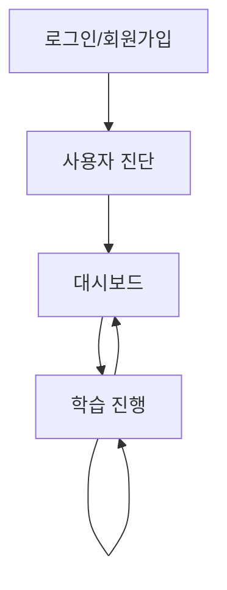

# 부록: UI 설계 v2.0

## 1. 🏗️ 전체 페이지 구조 개요

### 1.1 페이지 구성

```
AI 활용법 학습 튜터 애플리케이션 v2.0
├── 로그인/회원가입 페이지 (✅ 완성)
├── 사용자 진단 페이지 (✅ 완성)
├── 대시보드 페이지 (🔄 API 연동 예정)
└── 학습 진행 페이지 (🔄 통합 워크플로우 구현 예정)
```

### 1.2 페이지 네비게이션 흐름



---

## 2. 📱 페이지별 상세 설계 (v2.0 업데이트)

### 2.1 로그인/회원가입 페이지 (✅ 완성)

**현재 구현 상태:**
- 탭 기반 로그인/회원가입 전환
- 실시간 검증 및 중복 확인
- JWT 기반 자동 토큰 갱신

**로그인 화면:**
```
┌─────────────────────────────────────┐
│         AI 학습 튜터 로고           │
│                                     │
│        [로그인] [회원가입]          │
│                                     │
│      ┌─────────────────────┐        │
│      │   로그인 ID 입력창  │        │
│      ├─────────────────────┤        │
│      │   비밀번호 입력창   │        │
│      ├─────────────────────┤        │
│      │ □ 로그인 상태 유지  │        │
│      ├─────────────────────┤        │
│      │     [로그인 버튼]   │        │
│      └─────────────────────┘        │
│                                     │
└─────────────────────────────────────┘
```

### 2.2 사용자 진단 페이지 (✅ 완성)

**현재 구현 상태:**
- 5-7문항 진단 시스템
- 점수 계산 및 유형 추천
- 진단 결과 및 최종 유형 선택

**진단 결과 화면:**
```
┌─────────────────────────────────────┐
│            진단 결과                │
│                                     │
│       🎯 추천 사용자 유형           │
│         AI 입문자 (85점)            │
│                                     │
│  📊 상세 분석:                     │
│  • AI 사용 경험: 초급 수준          │
│  • 학습 목적: 업무 효율성           │
│  • 권장 챕터: 8개 (15시간)          │
│                                     │
│  다른 유형을 원하시나요?             │
│  ○ AI 입문자 (추천)                │
│  ○ 실무 응용형                     │
│                                     │
│      [선택 완료] 버튼               │
└─────────────────────────────────────┘
```

### 2.3 대시보드 페이지 (🔄 API 연동 예정)

**업데이트된 레이아웃:**
```
┌─────────────────────────────────────┐
│            상단 헤더 영역           │
│  [로고] [사용자명] [로그아웃]       │
├─────────────────────────────────────┤
│                                     │
│         학습 현황 요약 (v2.0)       │
│                                     │
│  📚 현재 진행: 2챕터 1섹션          │
│  ⏱️  총 학습시간: 2시간 30분       │
│  📊 객관식 정답률: 85%             │
│  📝 주관식 평균: 78점               │
│  🔥 연속 학습: 7일                 │
│                                     │
│         챕터 목록 (상세화)           │
│                                     │
│  ✅ 1. AI는 무엇인가? (4/4섹션)    │
│      - 평균 점수: 90점              │
│      - 학습 시간: 60분              │
│                                     │
│  ⏳ 2. LLM이란 무엇인가 (1/4섹션)  │
│      - 현재 진행 중                 │
│      - 학습 시간: 15분              │
│                                     │
│  🔒 3. 프롬프트란 무엇인가 (0/4섹션)│
│                                     │
│      [학습 계속하기 버튼]           │
│                                     │
└─────────────────────────────────────┘
```

**새로운 기능 추가:**
- 섹션별 진행 상태 표시
- 객관식/주관식 분리 통계
- 연속 학습일 표시
- 챕터별 상세 성과 정보

### 2.4 학습 진행 페이지 (🔄 통합 워크플로우 구현 예정)

**v2.0 통합 워크플로우 기반 레이아웃:**
```
┌─────────────────────────────────────────────────────────┐
│                    상단 헤더 영역                        │
│  [로고] [대시보드로] [사용자명]    [현재: 2챕터 1섹션]    │
│                                                         │
│   [📖 이론 설명] [📝 퀴즈 진행] [✅ 완료] [❓ 질문하기]   │
│        ●              ○             ○         ○        │
│                (세션 진행 단계 표시)                    │
├──────────────────────────────────┬────────────────────────┤
│                                  │                        │
│        메인 컨텐츠 영역          │      상호작용 영역     │
│             70%                  │        30%             │
│                                  │                        │
│  ┌─────────────────────────────┐ │  ┌──────────────────┐  │
│  │                             │ │  │                  │  │
│  │     동적 컨텐츠 표시        │ │  │ [채팅 모드]      │  │
│  │                             │ │  │                  │  │
│  │  현재 에이전트:             │ │  │  대화 히스토리   │  │
│  │  theory_educator            │ │  │                  │  │
│  │                             │ │  │  사용자: 질문    │  │
│  │  - 개념 설명 (이론 완료)    │ │  │  튜터: 답변      │  │
│  │  - 퀴즈 문제 (퀴즈 모드)    │ │  │                  │  │
│  │  - 피드백 결과 (피드백)     │ │  │                  │  │
│  │  - 질문 답변 (QnA)         │ │  │                  │  │
│  │  - 세션 완료 안내          │ │  │                  │  │
│  │                             │ │  └──────────────────┘  │
│  │                             │ │  ┌──────────────────┐  │
│  │  [스크롤 가능한 이전 내용]  │ │  │ [퀴즈 모드]      │  │
│  │                             │ │  │                  │  │
│  │                             │ │  │  ○ 선택지 1     │  │
│  │                             │ │  │  ○ 선택지 2     │  │
│  │                             │ │  │  ○ 선택지 3     │  │
│  │                             │ │  │  ○ 선택지 4     │  │
│  │                             │ │  │                  │  │
│  │                             │ │  │   [제출 버튼]    │  │
│  │                             │ │  │   [힌트 버튼]    │  │
│  └─────────────────────────────┘ │  └──────────────────┘  │
└──────────────────────────────────┴────────────────────────┘
```

---

## 3. 🔄 v2.0 통합 워크플로우 UI 시스템

### 3.1 단일 API 기반 UI 전환

**기존 문제점:**
- 여러 API 엔드포인트로 인한 복잡성
- 에이전트별 개별 호출 필요
- UI 상태 관리 복잡도 증가

**v2.0 해결책:**
- **단일 API**: `POST /learning/session/message`로 모든 상호작용 처리
- **통합 응답**: `workflow_response` 필드로 에이전트 정보 및 UI 모드 통합 제공
- **자동 라우팅**: SupervisorRouter가 사용자 의도에 따라 적절한 에이전트로 자동 라우팅

### 3.2 UI 모드 시스템 강화

**UI 모드 정의:**

| UI 모드 | 설명 | 트리거 조건 | 상호작용 영역 |
|---------|------|-------------|---------------|
| `chat` | 자유 대화 모드 | 기본 모드, 이론 설명, 피드백, QnA | 채팅 입력창 활성화 |
| `quiz` | 퀴즈 풀이 모드 | QuizGenerator 호출 시 | 객관식/주관식 답변 영역 |

**UI 모드 전환 흐름:**
```
session_start → chat (이론 설명)
theory_completed → 사용자 선택 → quiz (퀴즈) OR chat (질문)
quiz_answer → chat (피드백)
quiz_and_feedback_completed → 사용자 선택 → chat (세션 완료) OR chat (추가 질문)
```

### 3.3 에이전트별 UI 패턴

**TheoryEducator (이론 설명):**
```
┌─────────────────────────────────┐
│          2챕터 1섹션            │
│         LLM이란 무엇인가?       │
│                                 │
│  LLM(Large Language Model)은   │
│  대규모 언어 모델로, 방대한     │
│  텍스트 데이터를 학습하여...    │
│                                 │
│  💡 핵심 포인트:               │
│  • 대규모 데이터 학습           │
│  • 언어 이해 및 생성            │
│  • 문맥 파악 능력               │
│                                 │
│  📋 대표 예시:                 │
│  • ChatGPT (OpenAI)            │
│  • Claude (Anthropic)          │
│  • Bard (Google)               │
│                                 │
│  💬 "이해했어요, 다음으로!"     │
│  💬 "LLM과 AI의 차이가 뭐예요?" │
└─────────────────────────────────┘
```

**QuizGenerator (퀴즈 모드):**
```
┌──────────────────────────────────┬────────────────────────┐
│        메인 컨텐츠 영역          │    퀴즈 답변 영역      │
│             70%                  │        30%             │
│                                  │                        │
│  ┌─────────────────────────────┐ │  ┌──────────────────┐  │
│  │                             │ │  │                  │  │
│  │    📝 퀴즈 문제             │ │  │  선택지:         │  │
│  │                             │ │  │                  │  │
│  │    다음 중 LLM의 특징이     │ │  │  ○ 1. 대규모     │  │
│  │    아닌 것은?               │ │  │      데이터 학습  │  │
│  │                             │ │  │                  │  │
│  │    💡 힌트가 필요하신가요?   │ │  │  ○ 2. 실시간     │  │
│  │    [힌트 보기] 버튼          │ │  │      인터넷 검색  │  │
│  │                             │ │  │                  │  │
│  │                             │ │  │  ○ 3. 언어 이해  │  │
│  │                             │ │  │      능력        │  │
│  │                             │ │  │                  │  │
│  │                             │ │  │  ○ 4. 텍스트     │  │
│  │                             │ │  │      생성 능력    │  │
│  │                             │ │  │                  │  │
│  │                             │ │  │   [제출 버튼]    │  │
│  └─────────────────────────────┘ │  └──────────────────┘  │
└──────────────────────────────────┴────────────────────────┘
```

**EvaluationFeedbackAgent (피드백):**
```
┌─────────────────────────────────┐
│            평가 결과            │
│                                 │
│  ✅ 정답입니다! (100점)         │
│                                 │
│  📝 상세 피드백:               │
│  훌륭합니다! LLM의 핵심 특징을  │
│  정확히 이해하고 계시네요.      │
│  실시간 인터넷 검색은 LLM의     │
│  기본 기능이 아닙니다.          │
│                                 │
│  💡 추가 학습 포인트:          │
│  LLM은 학습된 데이터를 바탕으로 │
│  응답을 생성하며, 실시간       │
│  정보 검색이 필요한 경우...     │
│                                 │
│  🎯 다음 단계 결정:            │
│  점수가 우수하므로 다음 섹션으로│
│  진행하는 것을 권장합니다.      │
│                                 │
│  💬 "다음으로 진행해주세요"      │
│  💬 "추가 질문이 있어요"        │
└─────────────────────────────────┘
```

**QnAResolver (질문 답변):**
```
┌─────────────────────────────────┐
│            질문 답변            │
│                                 │
│  ❓ 질문: "LLM과 AI의 차이가    │
│           뭐예요?"              │
│                                 │
│  💬 답변:                     │
│  AI는 더 넓은 개념으로, 인간의  │
│  지능을 모방하는 모든 기술을    │
│  포함합니다. 머신러닝은 AI의    │
│  한 분야이고, LLM은 머신러닝의  │
│  한 종류입니다.                 │
│                                 │
│  📊 관계도:                    │
│  AI > 머신러닝 > 딥러닝 > LLM   │
│                                 │
│  🔗 관련 학습:                 │
│  3챕터에서 AI의 역사와 발전     │
│  과정을 더 자세히 다룹니다.     │
│                                 │
│  💬 "또 다른 질문이 있어요"      │
│  💬 "이해했어요, 계속해주세요"   │
└─────────────────────────────────┘
```

**SessionManager (세션 완료):**
```
┌─────────────────────────────────┐
│          세션 완료 안내         │
│                                 │
│  🎉 2챕터 1섹션 완료!           │
│                                 │
│  📊 이번 세션 결과:            │
│  • 학습 시간: 15분              │
│  • 퀴즈 점수: 100점             │
│  • 사용한 힌트: 0개             │
│                                 │
│  ➡️ 다음 학습:                │
│  2챕터 2섹션 "LLM의 동작 원리"  │
│  예상 소요 시간: 20분           │
│                                 │
│  💾 학습 기록이 저장되었습니다.  │
│                                 │
│  💬 "다음 섹션 시작할게요"       │
│  💬 "대시보드로 돌아가기"        │
└─────────────────────────────────┘
```

---

## 4. 💾 상태 관리 시스템 v2.0

### 4.1 Vue Pinia Store 구조 업데이트

**주요 상태 필드:**
- `currentAgent`: 현재 활성 에이전트
- `sessionProgressStage`: 세션 진행 단계
- `userIntent`: 사용자 의도
- `currentUIMode`: UI 모드 ('chat' | 'quiz')
- `mainContent`: 메인 컨텐츠 데이터 및 메타정보
- `lastWorkflowResponse`: 최근 워크플로우 응답
- `chatHistory`: 전체 대화 기록
- `currentQuizInfo`: 퀴즈 관련 상태
- `sessionInfo`: 세션 관리 정보

**주요 액션:**
- `sendMessage()`: 통합 메시지 전송
- `updateFromWorkflowResponse()`: 워크플로우 응답 처리
- `submitQuizAnswer()`: 퀴즈 답변 제출
- `startSession()`: 세션 시작
- `completeSession()`: 세션 완료

**주요 게터:**
- `isQuizMode` / `isChatMode`: UI 모드 판단
- `isSessionStart` / `isTheoryCompleted` / `isQuizAndFeedbackCompleted`: 세션 단계 판단
- `sessionSteps`: 진행 단계 표시용 데이터
- `canAskQuestion` / `canProceedNext`: 사용자 액션 가능 여부

### 4.2 API 서비스 통합 (v2.0)

**learningService 주요 메서드:**
- `startSession()`: 학습 세션 시작
- `sendMessage()`: 통합 메시지 전송 (모든 상호작용)
- `submitQuizAnswer()`: 퀴즈 답변 제출
- `completeSession()`: 세션 완료
- `getLearningHistory()`: 학습 기록 조회
- `getStatistics()`: 상세 통계 조회
- `getSessionDetails()`: 세션 상세 조회

---

## 5. 📱 컴포넌트 구조 v2.0

### 5.1 Vue 3 컴포넌트 계층 업데이트

```
App.vue
├── Router (vue-router)
│   ├── LoginPage.vue (✅ 완성)
│   ├── DiagnosisPage.vue (✅ 완성)
│   ├── DiagnosisResultPage.vue (✅ 완성)
│   ├── DashboardPage.vue (🔄 API 연동 예정)
│   └── LearningPage.vue (🔄 v2.0 통합 워크플로우 구현 예정)
│       ├── HeaderComponent.vue (✅ 완성)
│       ├── SessionProgressIndicator.vue (신규 - 단계 표시)
│       ├── MainContentArea.vue (v2.0 통합)
│       │   ├── TheoryContent.vue (에이전트별 컨텐츠)
│       │   ├── QuizContent.vue (객관식/주관식 통합)
│       │   ├── FeedbackContent.vue (평가 결과)
│       │   ├── QnAContent.vue (질문 답변)
│       │   └── SessionCompleteContent.vue (세션 완료)
│       ├── InteractionArea.vue (v2.0 통합)
│       │   ├── ChatMode.vue (자유 대화)
│       │   │   ├── ChatHistory.vue
│       │   │   └── ChatInput.vue
│       │   └── QuizMode.vue (퀴즈 풀이)
│       │       ├── MultipleChoiceInput.vue
│       │       ├── SubjectiveInput.vue
│       │       └── HintButton.vue
│       └── LoadingModal.vue (에이전트별 로딩)
```

### 5.2 새로운 핵심 컴포넌트

**SessionProgressIndicator.vue (신규):**
- 세션 진행 단계 시각화
- 단계별 활성/완료/비활성 상태 표시
- 연결선과 아이콘으로 직관적인 진행 상황 제공

**InteractionArea.vue (v2.0 통합):**
- chat/quiz 모드 자동 전환
- 에이전트별 로딩 상태 처리
- 사용자 액션 이벤트 통합 관리

**MainContentArea.vue (v2.0 통합):**
- 에이전트별 동적 컴포넌트 렌더링
- 스크롤 가능한 채팅 기록 표시
- 사용자 액션 이벤트 처리

---

## 6. 🎯 실시간 UI 업데이트 시스템

### 6.1 에이전트별 UI 전환 로직

**UI 전환 매핑:**
- `theory_educator`: slideInLeft 애니메이션 + 이론 테마
- `quiz_generator`: fadeIn + 모드 전환 + 퀴즈 테마
- `evaluation_feedback_agent`: bounceIn + 피드백 테마
- `qna_resolver`: slideInRight + QnA 테마
- `session_manager`: zoomIn + 세션 완료 테마

### 6.2 UI 모드 전환 가이드

| 전환 시나리오 | UI 변화 | 애니메이션 |
|---------------|---------|------------|
| 세션 시작 → 이론 설명 | chat 모드, 이론 컨텐츠 표시 | slideInLeft |
| 이론 완료 → 퀴즈 생성 | quiz 모드, 선택지/입력창 표시 | fadeIn + 모드 전환 |
| 퀴즈 답변 → 피드백 | chat 모드, 평가 결과 표시 | bounceIn |
| 피드백 → 질문 답변 | chat 모드, QnA 컨텐츠 표시 | slideInRight |
| 피드백 → 세션 완료 | chat 모드, 완료 안내 표시 | zoomIn |

---

## 7. 🔧 스타일링 시스템 v2.0

### 7.1 CSS 변수 및 테마 시스템

**색상 시스템:**
- 기본 컬러: primary, secondary, accent, success, warning, error
- 에이전트별 컬러: theory, quiz, feedback, qna, session
- UI 모드별 배경: chat-mode-bg, quiz-mode-bg, loading-bg

**간격 시스템:**
- xs(0.25rem) ~ 2xl(3rem) 단위
- 일관된 spacing 변수 사용

**반응형 브레이크포인트:**
- sm(640px), md(768px), lg(1024px), xl(1280px)

### 7.2 에이전트별 컴포넌트 스타일

**메인 컨텐츠 영역:**
- 에이전트별 왼쪽 테두리 색상
- 그라데이션 배경으로 구분
- 부드러운 전환 애니메이션

**진행 단계 표시:**
- 원형 아이콘 + 연결선
- 활성/완료/비활성 상태 구분
- 단계별 색상 및 크기 변화

**퀴즈 모드:**
- 선택지 hover/selected 상태
- 힌트/제출 버튼 스타일링
- 객관식/주관식 통합 디자인

**애니메이션 클래스:**
- slideInLeft, slideInRight, fadeIn, bounceIn, zoomIn
- 각 애니메이션별 최적화된 duration 설정

---

## 8. 📋 v2.0 주요 변경사항 요약

### 8.1 워크플로우 통합 개선
- **단일 API 엔드포인트**: `POST /learning/session/message`로 모든 상호작용 통합
- **SupervisorRouter 기반**: 중앙집중식 라우팅으로 사용자 의도에 따른 자동 에이전트 선택
- **통합 응답 구조**: `workflow_response` 필드로 에이전트 정보, UI 모드, 컨텐츠 통합 제공

### 8.2 UI 시스템 강화
- **하이브리드 UX**: chat/quiz 모드 자동 전환으로 자연스러운 사용자 경험
- **에이전트별 테마**: 시각적으로 구분되는 에이전트별 UI 테마 적용
- **실시간 진행 표시**: 세션 진행 단계를 직관적으로 표시하는 SessionProgressIndicator
- **부드러운 전환**: 에이전트 간 전환 시 적절한 애니메이션 효과

### 8.3 상태 관리 최적화
- **통합 Store**: TutorState와 Vue Pinia store 간 완전한 동기화
- **자동 UI 업데이트**: 워크플로우 응답에 따른 자동 UI 모드 전환
- **컴포넌트 재사용성**: 에이전트별 컨텐츠 컴포넌트 모듈화

---

## 9. 🎯 구현 우선순위

### 9.1 즉시 구현 (Phase 1)
1. **LearningPage.vue**: v2.0 통합 워크플로우 기반 학습 진행 페이지
2. **InteractionArea.vue**: chat/quiz 모드 통합 상호작용 영역
3. **MainContentArea.vue**: 에이전트별 동적 컨텐츠 표시
4. **SessionProgressIndicator.vue**: 진행 단계 시각화

### 9.2 단계별 구현 (Phase 2)
1. **에이전트별 컨텐츠 컴포넌트**: TheoryContent, QuizContent, FeedbackContent 등
2. **DashboardPage.vue**: API 연동 기반 학습 현황 대시보드
3. **스타일링 시스템**: 에이전트별 테마 및 애니메이션 적용

### 9.3 고도화 (Phase 3)
1. **애니메이션 시스템**: 부드러운 에이전트 전환 효과
2. **상태 관리 최적화**: Store 성능 개선
3. **UI/UX 개선**: 사용자 피드백 반영

---

## 10. 🔄 기존 시스템과의 호환성

### 10.1 완성된 컴포넌트 유지
- **LoginPage.vue**: 기존 인증 시스템 그대로 유지
- **DiagnosisPage.vue**: 기존 진단 시스템 그대로 유지
- **HeaderComponent.vue**: 기존 헤더 컴포넌트 재사용

### 10.2 API 호환성
- 기존 인증 API (`/auth/*`) 유지
- 기존 진단 API (`/diagnosis/*`) 유지
- 새로운 학습 API (`/learning/*`) 추가

### 10.3 상태 관리 마이그레이션
- 기존 authStore, diagnosisStore 유지
- 새로운 tutorStore 추가
- 기존 라우터 가드 시스템 유지

---

*UI 설계 버전: v1.3 → v2.0*  
*최종 수정일: 2025.08.17*  
*주요 변경사항: 통합 워크플로우 기반 UI 시스템, 하이브리드 UX 설계, 에이전트별 테마 시스템*  
*연관 문서: AI 활용법 학습 튜터 PRD v2.0, API 설계 v2.0, LangGraph State 설계 v2.0*