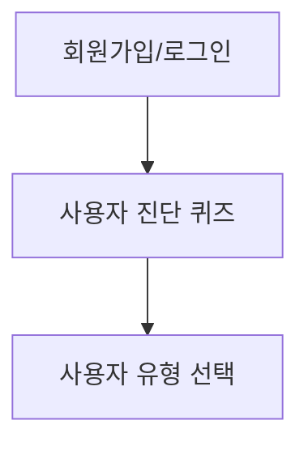
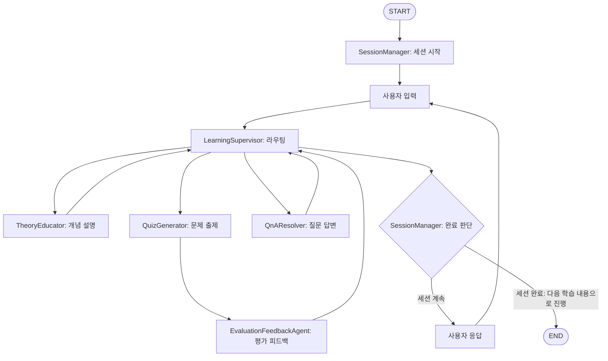

# 📄 AI 활용법 학습 튜터 (AI Skill Tutor) PRD v1.3

## 1. 🧭 개요

| 항목 | 내용 |
| --- | --- |
| 프로젝트명 | AI 활용법 학습 튜터 (AI Skill Tutor) |
| 목적 | 다양한 수준의 사용자가 AI(특히 LLM)를 이해하고 실용적으로 활용할 수 있도록 돕는 멀티에이전트 기반 튜터링 시스템 제공 |
| 대상 사용자 | ① AI 입문자 ② 실무 응용형 사용자 |
| 핵심 기능 | 사용자 진단 → 사용자 유형 선택 → 맞춤형 커리큘럼 진행 → 개념 학습 → 실습 및 평가 → 학습 기록 저장 |

---

## 2. 👣 사용자 흐름 

### 2.1 최초 1회 온보딩



### 2.2 학습 진행 흐름



**세션 완료 의미**: 현재 학습 단위(챕터 또는 학습 구간)를 완료하고 다음 학습 내용으로 진행하는 것을 의미합니다.

### 2.3 사용자 시나리오 (1학습 세션 흐름)

**개념 학습 → 문제 풀이 → 평가 완료**까지의 1학습 세션 예시:

```
1. 사용자: "1챕터 시작할게요"
   → LearningSupervisor → TheoryEducator → LearningSupervisor 
   → 사용자: "AI는 인간의 지능을 모방한 기술입니다..."

2. 사용자: "이해했어요, 다음 단계 해주세요"  
   → LearningSupervisor → QuizGenerator → LearningSupervisor
   → 사용자: "다음 중 AI의 특징이 아닌 것은?"

3. 사용자: "2번이요"
   → LearningSupervisor → EvaluationFeedbackAgent → LearningSupervisor  
   → 사용자: "정답입니다! 다음 단계로 진행할까요?"

4. 사용자: "네"
   → SessionManager가 "이 세션 완료" 판단
   → LearningSupervisor → 사용자: "1챕터가 완료되었습니다"
```

**중간 질문 처리 예시:**
```
개념 설명 후 → 사용자: "AI와 머신러닝 차이가 뭐예요?"
→ LearningSupervisor → QnAResolver → LearningSupervisor
→ 사용자: "AI는 더 넓은 개념이고..." → 다시 학습 진행
```

---

## 3. 🧑‍💻 기술 요구사항

### 백엔드

- **Python (Flask)**
    - REST API 서버
    - Blueprint 기반 구조화
- **MySQL 8.0** (PyMySQL 사용)
- **LangChain, LangGraph, LangSmith** 활용
- **ChromaDB 기반 벡터 데이터베이스** 연동

### 프론트엔드

- **Vue 3** (Vite + Composition API)
- **SCSS** (Nesting), Bootstrap 기반 UI
- **상태관리:** Pinia
- **HTTP 통신:** Axios
- **라우터:** vue-router
- **UI 모드 관리:** 자유 대화 ↔ 제한 UI 전환

### 기타

- **JWT 기반** 인증/인가
- **CORS 설정**
- **비밀번호 bcrypt** 암호화
- **실시간 AI API** 연동 (Gemini/GPT)

---

## 4. 👥 사용자 유형별 학습 경로 (구체화)

### 4.1 사용자 진단 문항 구성 (5-7문)

**진단 항목:**
1. **AI 사용 경험** - ChatGPT 등 AI 도구 사용 경험 여부
2. **학습 목적** - 업무 효율성 vs 호기심 vs 자기계발 등
3. **업무 특성** - 문서작업 중심 vs 소통 중심 vs 분석 업무 등
4. **AI 관심도** - AI 관련 뉴스/정보 접촉 정도

### 4.2 🧠 AI 입문자

**타겟 특성:**
* 업무에서 컴퓨터를 사용하는 일반 직장인 (학력 무관)
* 비전공자 기준: IT/컴퓨터공학/데이터사이언스 전공이 아님, 프로그래밍 경험 없음, AI/머신러닝 체계적 학습 경험 없음
* 복잡한 기술 용어보다는 직관적이고 쉬운 설명을 선호

**학습 목표:**
* AI와 LLM의 기본 개념 이해
* 프롬프트 작성의 기초 원리 습득
* ChatGPT 등 AI 도구의 기본적인 활용법 체득

**학습 시간:**
* 1회 학습시간: 15분 내외
* 총 학습시간: 15시간 (1학점 기준)
* 총 챕터: 8챕터
* ※ 8개 챕터 상세 내용은 부록에서 작성 예정

### 4.3 💼 실무 응용형 사용자

**타겟 특성:**
* 관련 학과 출신(컴퓨터공학, 전자공학, 정보통신 등) 또는 프로그래밍 교육(국비교육, 부트캠프 등) 이수자
* 직급 무관 일반 직장인
* 기술적 배경은 있지만 AI/머신러닝 전문 교육은 받지 않음
* 프로그래밍 개념과 논리적 사고에 익숙함
* 이론보다는 실용적이고 구체적인 활용법에 관심
* 시간 효율성을 중시하며 빠른 성과를 원함

**학습 목표:**
* AI 기술의 실무적 이해
* 고급 활용 기법 습득
* 업무 적용 및 최적화 능력

**학습 시간:**
* 1회 학습시간: 20-30분
* 총 학습시간: 20시간
* 총 챕터: 10챕터

**챕터 구성:**
* **기본 8챕터**: AI 입문자 주제 재활용, 설명 수준을 기술적 배경에 맞게 상향
* **추가 2챕터**:
   * 9챕터: 고급 프롬프트 엔지니어링 (Chain-of-Thought, Few-shot 등)
   * 10챕터: API 연동 및 자동화 (간단한 스크립트 작성, 워크플로우 구축)
* ※ 10개 챕터 상세 내용은 부록에서 작성 예정

### 4.4 사용자 유형별 차별화 요소

| 구분 | AI 입문자 | 실무 응용형 |
| --- | --- | --- |
| **설명 방식** | 단계별 상세 설명, 일상생활 비유 | 기술적 원리 중심, 논리적 구조화 |
| **예시 유형** | 일상생활 비유 | 실무 케이스, 코드 예제 |
| **실습 난이도** | 기초적 프롬프트 | 복합적 프롬프트, API 활용 |
| **피드백 스타일** | 격려 중심 | 개선점 및 최적화 방안 중심 |
| **진행 속도** | 느린 속도, 반복 학습 | 빠른 속도, 효율성 중시 |
| **평가 기준** | 이해도 중심 | 실용성 및 적용 가능성 중심 |

---

## 5. 📚 AI 입문자 학습 챕터 구성 임시

| 챕터 | 주제 | 학습 목표 | 주요 실습 |
| --- | --- | --- | --- |
| 1 | AI는 무엇인가? | AI/ML/DL 차이와 개념 정리 | 개념 구분 퀴즈 |
| 2 | LLM이란 무엇인가 | GPT, BERT, Transformer 이해 | LLM 종류 분류 |
| 3 | 프롬프트란 무엇인가 | 프롬프트 기본 구조와 작성법 | 실제 프롬프트 작성 실습 |
| 4 | ChatGPT로 할 수 있는 것들 | 요약, 번역, 질문 생성 등 체험 | 다양한 활용법 실습 |
| 5 | 좋은 프롬프트 작성법 | 명확한 지시, 구체적 요구사항 작성 | 프롬프트 개선 실습 |
| 6 | 역할 지정과 맥락 제공 | 페르소나 설정, 배경정보 활용 | 역할별 프롬프트 작성 |
| 7 | 단계별 사고 유도하기 | Chain-of-Thought 기초 개념 | 단계별 추론 실습 |
| 8 | AI와 함께하는 일상업무 | 문서작성, 이메일, 아이디어 도출 | 실무 시나리오 실습 |

---

## 6. 🤖 MAS 아키텍처 (멀티에이전트 시스템)

### 6.1 최적화된 에이전트 구조

```
SessionManager (세션 관리 전담)
└── LearningSupervisor (사용자 대면 + 라우팅 + 응답 생성)
    ├── TheoryEducator (개념 설명 대본 생성)
    ├── QuizGenerator (문제 출제 대본 생성)
    ├── EvaluationFeedbackAgent (평가 및 피드백 대본 생성)
    └── QnAResolver (질문 답변 대본 생성)
```

### 6.2 에이전트 상세 정보

**SessionManager (세션 관리 전담)**

- 역할: 학습 세션 생명주기 관리, 진도 추적, 세션 완료 판단
- 주요 도구: session_initialization_tool, session_completion_analysis_tool
- 활성 구간: 세션 시작 시점, 모든 에이전트 작업 완료 후 세션 종료 판단
- 판단 결과: "세션 계속" 또는 "세션 완료(다음 학습 내용 진행)"로 분류

**LearningSupervisor (사용자 대면 + 라우팅 + 응답 생성)**

- 역할: 사용자와 직접 소통, 의도 파악, 에이전트 라우팅, 대본을 바탕으로 최종 응답 생성
- 라우팅 대상: TheoryEducator, QuizGenerator, QnAResolver (모든 에이전트 완료 후 복귀)
- 주요 도구: user_intent_analysis_tool, response_generation_tool
- 활성 구간: 사용자 입력 수신 시점, 각 에이전트 대본 수신 후

**TheoryEducator (개념 설명 대본 생성)**

- 역할: 개념 설명 컨텐츠 생성 (사용자와 직접 소통 없음)
- 주요 도구: theory_generation_tool, vector_search_tool
- 활성 구간: LearningSupervisor로부터 이론 설명 요청 시
- 콘텐츠 소스: 벡터 DB에 저장된 직접 선별한 고품질 학습 자료 참조
- 결과물: 설명 대본을 LearningSupervisor에게 전달 후 복귀

**QuizGenerator (문제 출제 대본 생성)**

- 역할: 문제 출제 컨텐츠 생성 (사용자와 직접 소통 없음)
- 주요 도구: quiz_generation_tool, prompt_practice_tool, hint_generation_tool, vector_search_tool
- 활성 구간: LearningSupervisor로부터 문제 출제 요청 시
- 콘텐츠 소스: 벡터 DB에 저장된 문제 템플릿 및 평가 기준 참조
- 결과물: 문제 대본을 LearningSupervisor에게 전달
- 후속 처리: 반드시 EvaluationFeedbackAgent로 연결

**EvaluationFeedbackAgent (평가 및 피드백 대본 생성)**

- 역할: 답변 평가 및 피드백 컨텐츠 생성 (사용자와 직접 소통 없음)
- 주요 도구: answer_evaluation_tool, feedback_generation_tool
- 활성 구간: QuizGenerator 완료 후 자동 호출
- 결과물: 평가 피드백 대본을 LearningSupervisor에게 전달 후 복귀

**QnAResolver (질문 답변 대본 생성)**

- 역할: 실시간 질문 답변 컨텐츠 생성 (사용자와 직접 소통 없음)
- 주요 도구: vector_search_tool, web_search_tool, context_integration_tool
- 활성 구간: LearningSupervisor로부터 질문 해결 요청 시 (개념 설명 후, 평가 피드백 후 등 언제든지 가능)
- 결과물: 답변 대본을 LearningSupervisor에게 전달 후 복귀

---

## 7. 🔧 Tool 시스템

### 7.1 Tool 분류 및 배정

**컨텐츠 생성 Tools:**

- `theory_generation_tool` - 사용자 레벨별 맞춤 설명 대본 생성 (TheoryEducator)
- `quiz_generation_tool` - 객관식/프롬프트 문제 대본 생성 (QuizGenerator)
- `hint_generation_tool` - 문제별 맞춤 힌트 대본 생성 (QuizGenerator)
- `feedback_generation_tool` - 개인화된 피드백 대본 생성 (EvaluationFeedbackAgent)

**외부 연동 Tools:**

- `prompt_practice_tool` - 사용자 프롬프트 → AI API 실제 테스트 (QuizGenerator)
- `vector_search_tool` - ChromaDB 벡터 검색 (QnAResolver)
- `web_search_tool` - 웹 검색, datetime에서 current_time 정보를 받아와 프롬프트에 포함하여 시간대별 정확한 검색 수행 (QnAResolver)

**분석/평가/관리 Tools:**

- `answer_evaluation_tool` - 답변 채점 및 이해도 측정 (EvaluationFeedbackAgent)
- `user_intent_analysis_tool` - 사용자 의도 분석 및 라우팅 결정 (LearningSupervisor)
- `response_generation_tool` - 에이전트 대본을 바탕으로 최종 사용자 응답 생성 (LearningSupervisor)
- `session_initialization_tool` - 새 학습 세션 초기화 (SessionManager)
- `session_completion_analysis_tool` - 세션 완료 여부 분석 (SessionManager)
- `context_integration_tool` - 현재 학습 맥락과 질문 연결 (QnAResolver)

### 7.2 Tool 사용 흐름

```
세션 시작: session_initialization_tool
일반 학습: user_intent_analysis_tool → theory_generation_tool → response_generation_tool
문제 출제: user_intent_analysis_tool → quiz_generation_tool → answer_evaluation_tool → feedback_generation_tool → response_generation_tool
세션 완료 판단: session_completion_analysis_tool
힌트 요청: hint_generation_tool (필요 시)
질문 발생: vector_search_tool + web_search_tool + context_integration_tool → response_generation_tool
프롬프트 실습: prompt_practice_tool (AI API 연동)
```

---

## 8. 🧩 기능 명세서 

| 기능 | 설명 | 구현 방식 |
| --- | --- | --- |
| 회원가입/로그인 | JWT 인증 기반 로그인 및 사용자 정보 저장 | Flask + JWT + bcrypt |
| 진단 퀴즈 | 사용자 목적 및 수준을 판단하는 간단한 선택형 문항 제공 | 사전 정의된 문항 세트 |
| 중앙집중식 라우팅 | LearningSupervisor 기반 통합 라우팅 관리 | 규칙 기반 + 패턴 매칭 분류 |
| 개념 설명 | 사용자 레벨별 맞춤 개념 정리 및 예시 제시 | theory_generation_tool |
| 하이브리드 UX | 자유 대화 구간과 제한 UI 구간의 적절한 조합 | Vue.js 상태 관리 + UI 모드 전환 |
| 문제 출제 | 객관식/프롬프트 작성 문제 및 힌트 시스템 제공 | quiz_generation_tool + hint |
| 실제 AI 연동 | 사용자 프롬프트를 실제 AI API로 테스트 | prompt_practice_tool |
| 평가 및 피드백 | 자동 채점, 이해도 측정, 개인화된 피드백 제공 | answer_evaluation_tool |
| 세션 관리 | 학습 세션 생명주기 관리 및 완료 판단 | SessionManager |
| 응답 생성 | 에이전트 대본을 바탕으로 사용자 친화적 최종 응답 생성 | LearningSupervisor |
| 유연한 Q&A | 개념 설명 후, 평가 피드백 후 등 언제든지 질문 답변 가능 | QnAResolver + 순환 구조 |
| 실시간 Q&A | **ChromaDB 벡터 검색 + 웹 검색** 기반 질문 답변 시스템 | vector_search_tool + web_search_tool |
| 학습 기록 저장 | 루프 완료 시 전체 진행 요약 및 DB 저장 | MySQL 기반 저장 |
| AI 모델 유연성 | 다중 AI 제공자 지원 및 동적 모델 전환 | 추상화 레이어 + 환경 설정 |

---

## 9. 🎯 MVP 범위 

| 항목 | 범위 |
| --- | --- |
| 사용자 흐름 | 로그인 → 진단 → AI 입문자 유형 → 모든 챕터 완성 |
| 학습 챕터 | AI 입문자 유형의 모든 챕터 (1-8) 완전 구현 |
| MAS 구성 | 5개 핵심 에이전트 (SessionManager + LearningSupervisor 중심 구조) |
| UX 구현 | 하이브리드 UX 패턴, 힌트 시스템, 자유대화↔제한UI 전환 |
| 프론트엔드 | Vue 3 기반 적응형 UI, Pinia 상태관리, 실시간 UI 모드 전환 |
| 백엔드 | Flask REST API, LangGraph 워크플로우, MySQL 연동, AI API 연동, ChromaDB 연동 |
| 최적화 항목 | SessionManager 세션 관리 분리, LearningSupervisor 대본 기반 응답 생성, 유연한 질답 시스템 |

---

## 10. 🚀 확장성 

| 항목 | 내용 |
| --- | --- |
| 사용자 유형 추가 | 실무 응용형 사용자 |
| 개인별 맞춤 플랜 생성하는 에이전트 팀 추가 | 사용자별 학습 경로 및 커리큘럼 동적 생성 |
| 사용자 진단 에이전트 추가 | 심화된 사용자 분석 및 맞춤형 진단 시스템 |
| AI 모델 확장 | 새로운 모델 제공자 추가, 특화 모델 도입 |

---

## 11. 🤖 AI 모델 운영 전략 

### 11.1 모델 선택 기준

**개발 단계:**
- **Gemini 2.5 Flash**: 기본 대화, 콘텐츠 생성, 간단한 추론
- **비용 효율성 중심**: 빠른 프로토타이핑 및 테스트

**운영 단계:**
- **일반 학습**: Gemini 2.5 Flash → 필요시 GPT-4o-mini
- **복잡한 추론**: Gemini 2.5 Pro
- **고급 기능**: o4-mini (시각적 이해, 도구 통합 필요시)

### 11.4 임베딩 시스템

**text-embedding-3-large 고정 사용:**
- ChromaDB 벡터 저장
- 학습 콘텐츠 유사도 검색
- QnA 맥락 매칭
- 사용자 학습 패턴 분석

---

*PRD 버전: v1.3*

*최종 수정일: 2025.08.06*

*작성자: 개발팀*

*주요 변경사항: AI 모델 운영 전략 섹션 최적화, 모델 선택 기준과 임베딩 시스템 중심으로 간소화*