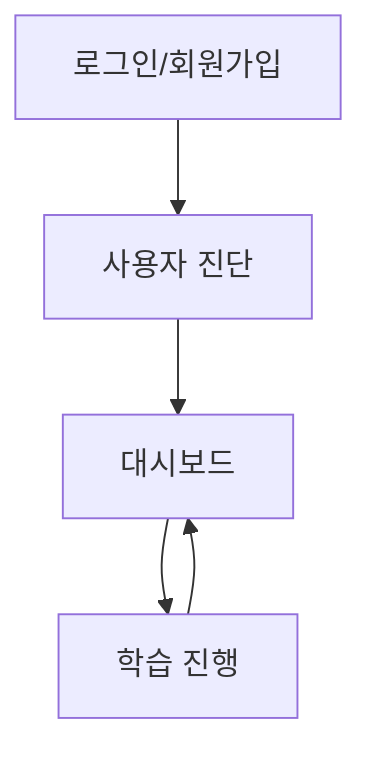

# 부록: UI 설계 v1.3

## 1. 🏗️ 전체 페이지 구조 개요

### 1.1 페이지 구성

```
AI 활용법 학습 튜터 애플리케이션
├── 로그인/회원가입 페이지
├── 사용자 진단 페이지  
├── 대시보드 페이지
└── 학습 진행 페이지
```

### 1.2 페이지 네비게이션 흐름



---

## 2. 📱 페이지별 상세 설계

### 2.1 로그인/회원가입 페이지

**로그인 화면:**
```
┌─────────────────────────────────────┐
│            브랜드 로고              │
│                                     │
│        [로그인] [회원가입]          │
│                                     │
│      ┌─────────────────────┐        │
│      │   로그인 ID 입력창  │        │
│      ├─────────────────────┤        │
│      │   비밀번호 입력창   │        │
│      ├─────────────────────┤        │
│      │     [로그인 버튼]   │        │
│      └─────────────────────┘        │
│                                     │
└─────────────────────────────────────┘
```

**회원가입 화면:**
```
┌─────────────────────────────────────┐
│            브랜드 로고              │
│                                     │
│        [로그인] [회원가입]          │
│                                     │
│      ┌─────────────────────┐        │
│      │   로그인 ID 입력창  │        │
│      ├─────────────────────┤        │
│      │   닉네임 입력창     │        │
│      ├─────────────────────┤        │
│      │   이메일 입력창     │        │
│      ├─────────────────────┤        │
│      │   비밀번호 입력창   │        │
│      ├─────────────────────┤        │
│      │   비밀번호 확인창   │        │
│      ├─────────────────────┤        │
│      │    [회원가입 버튼]  │        │
│      └─────────────────────┘        │
│                                     │
└─────────────────────────────────────┘
```

**기능:**
- JWT 기반 인증 처리
- 로그인: login_id + password
- 회원가입: login_id + username + email + password
- 로그인 성공 시 사용자 진단 완료 여부에 따라 라우팅

### 2.2 사용자 진단 페이지

**레이아웃:**
```
┌─────────────────────────────────────┐
│        사용자 진단 퀴즈             │
│                                     │
│  질문 1/7: AI 사용 경험이 있나요?   │
│                                     │
│    ○ 전혀 없음                     │
│    ○ 가끔 사용                     │
│    ○ 자주 사용                     │
│                                     │
│            [다음 버튼]              │
│                                     │
│    ●○○○○○○ (진행 표시바)           │
│                                     │
└─────────────────────────────────────┘
```

**기능:**
- 5-7문항의 진단 퀴즈 진행
- 진행률 표시바
- 완료 시 사용자 유형 결정 (AI 입문자/실무 응용형)
- 진단 완료 후 대시보드로 이동

### 2.3 대시보드 페이지

**레이아웃:**
```
┌─────────────────────────────────────┐
│            상단 헤더 영역           │
│  [로고] [사용자명] [로그아웃]       │
├─────────────────────────────────────┤
│                                     │
│         학습 현황 요약              │
│                                     │
│  📚 현재 진행: 1챕터               │
│  ⏱️  총 학습시간: 2시간 30분       │
│  📊 평균 정답률: 85%               │
│                                     │
│         챕터 목록                   │
│                                     │
│  ✅ 1. AI는 무엇인가?              │
│  ⏳ 2. LLM이란 무엇인가           │
│  🔒 3. 프롬프트란 무엇인가         │
│                                     │
│      [학습 계속하기 버튼]           │
│                                     │
└─────────────────────────────────────┘
```

**기능:**
- 학습 진행 현황 표시
- 챕터별 진도 및 상태 확인
- 학습 통계 정보 (시간, 정답률 등)
- 학습 진행 페이지로 이동

### 2.4 학습 진행 페이지

**메인 레이아웃 (좌우 분할 7:3):**
```
┌─────────────────────────────────────────────────────────┐
│                    상단 헤더 영역                        │
│  [로고] [대시보드로] [사용자명]    [현재 챕터: 1/8]      │
│                                                         │
│              [📖 이론 설명] [📝 퀴즈 진행] [✅ 완료]      │
│                    (세션 진행 단계 표시)                │
├──────────────────────────────────┬────────────────────────┤
│                                  │                        │
│        메인 컨텐츠 영역          │      채팅 영역         │
│             70%                  │        30%             │
│                                  │                        │
│  ┌─────────────────────────────┐ │  ┌──────────────────┐  │
│  │                             │ │  │  대화 히스토리   │  │
│  │     동적 컨텐츠 표시        │ │  │                  │  │
│  │                             │ │  │  사용자: 안녕    │  │
│  │  - 개념 설명               │ │  │  튜터: 안녕하세요│  │
│  │  - 퀴즈 문제               │ │  │                  │  │
│  │  - 피드백 결과             │ │  │                  │  │
│  │  - 이전 내용 (스크롤)      │ │  │                  │  │
│  │                             │ │  └──────────────────┘  │
│  └─────────────────────────────┘ │  ┌──────────────────┐  │
│                                  │  │ [메시지 입력창]  │  │
│                                  │  │     [전송]       │  │
│                                  │  └──────────────────┘  │
└──────────────────────────────────┴────────────────────────┘
```

**기능:**
- 실시간 학습 진행
- 에이전트별 동적 UI 전환
- 이전 학습 내용 스크롤 탐색
- 자유 대화 및 퀴즈 모드 전환
- 세션 진행 단계 시각적 표시

---

## 3. 🔄 UI 모드 시스템

### 3.1 UI 모드 정의

**기본 모드 (채팅 활성):**
- 메인 영역: 학습 컨텐츠 표시
- 채팅 영역: 자유 대화 가능

**퀴즈 모드 (채팅 비활성):**
- 메인 영역: 퀴즈 문제 표시 (객관식/주관식 동일 레이아웃)
- 채팅 영역 → 답변 입력 영역 전환

### 3.2 퀴즈 모드 전환

**전환 트리거:**
- LangGraph State의 `ui_mode === "quiz"`

**퀴즈 모드 레이아웃 (객관식/주관식 공통):**
```
┌──────────────────────────────────┬────────────────────────┐
│        메인 컨텐츠 영역          │    답변 입력 영역      │
│             70%                  │        30%             │
│                                  │                        │
│  ┌─────────────────────────────┐ │  ┌──────────────────┐  │
│  │                             │ │  │                  │  │
│  │    문제: ChatGPT에서        │ │  │  [객관식 문제]   │  │
│  │    가장 중요한 것은?        │ │  │  ○ 선택지 1     │  │
│  │                             │ │  │  ○ 선택지 2     │  │
│  │    [힌트 버튼]              │ │  │  ○ 선택지 3     │  │
│  │                             │ │  │                  │  │
│  │                             │ │  │  [주관식 문제]   │  │
│  │                             │ │  │  ┌──────────────┐ │  │
│  │                             │ │  │  │텍스트 입력창│ │  │
│  │                             │ │  │  └──────────────┘ │  │
│  │                             │ │  │                  │  │
│  │                             │ │  │   [제출 버튼]    │  │
│  └─────────────────────────────┘ │  └──────────────────┘  │
└──────────────────────────────────┴────────────────────────┘
```

---

## 4. 🎨 컨텐츠 영역별 UI 패턴

### 4.1 대시보드 화면

```
┌─────────────────────────────────┐
│         학습 현황 요약          │
│                                 │
│  📚 현재 진행: 1챕터           │
│  ⏱️  총 학습시간: 2시간 30분   │
│  📊 평균 정답률: 85%           │
│                                 │
│         챕터 목록               │
│                                 │
│  ✅ 1. AI는 무엇인가?          │
│  ⏳ 2. LLM이란 무엇인가       │
│  🔒 3. 프롬프트란 무엇인가     │
│                                 │
│      [학습 계속하기 버튼]       │
└─────────────────────────────────┘
```

### 4.2 개념 설명 화면

```
┌─────────────────────────────────┐
│          챕터 1: AI란?          │
│                                 │
│  AI(인공지능)는 인간의 지능을   │
│  모방하여 학습, 추론, 판단 등을 │
│  수행하는 컴퓨터 시스템입니다.  │
│                                 │
│  [이미지/도표 영역]             │
│                                 │
│  💡 핵심 포인트:               │
│  • 학습 능력                   │
│  • 패턴 인식                   │
│  • 자동화된 의사결정            │
│                                 │
│      [다음 단계로] 버튼         │
└─────────────────────────────────┘
```

### 4.3 피드백 화면

```
┌─────────────────────────────────┐
│            평가 결과            │
│                                 │
│  ✅ 정답입니다! (85점)          │
│                                 │
│  📝 상세 피드백:               │
│  훌륭합니다. AI의 핵심 개념을   │
│  정확히 이해하고 계시네요.      │
│                                 │
│  💡 추가 학습 포인트:          │
│  머신러닝과 딥러닝의 차이점도   │
│  함께 알아보시면 좋겠습니다.    │
│                                 │
│  [다음 문제로] [추가 질문하기]  │
└─────────────────────────────────┘
```

### 4.4 세션 완료 안내 화면

```
┌─────────────────────────────────┐
│          세션 완료 안내         │
│                                 │
│  [Proceed 시]                   │
│  🎉 1챕터를 완료했습니다!       │
│  다음 챕터로 넘어가겠습니다.    │
│                                 │
│  [Retry 시]                     │
│  🔄 현재 내용을 한 번 더        │
│  학습해보겠습니다.              │
│                                 │
│      [확인] 버튼                │
└─────────────────────────────────┘
```

---

## 5. 🔧 상태 관리 시스템

### 5.1 Pinia Store 구조

```javascript
// stores/tutorStore.js
export const useTutorStore = defineStore('tutor', {
  state: () => ({
    // UI 모드 제어
    currentUIMode: 'chat', // 'chat' | 'quiz'
    
    // LangGraph State 연동
    currentAgent: 'learning_supervisor',
    sessionProgressStage: 'session_start', // 'session_start' | 'theory_completed' | 'quiz_and_feedback_completed'
    
    // 메인 컨텐츠 표시
    mainContent: {
      type: 'dashboard', // 'dashboard' | 'theory' | 'quiz' | 'feedback' | 'session_complete'
      data: null
    },
    
    // 채팅 관리
    chatHistory: [],
    isLoading: false,
    loadingMessage: '',
    
    // 사용자 정보
    userInfo: {
      userId: null,
      userType: 'unassigned', // 'beginner' | 'advanced'
      currentChapter: 1
    },
    
    // 퀴즈 관리
    currentQuizInfo: {
      questionType: '', // 'multiple_choice' | 'subjective'
      questionContent: '',
      userAnswer: '',
      hintCount: 0
    }
  }),
  
  actions: {
    // UI 모드 전환
    switchToQuizMode() {
      this.currentUIMode = 'quiz'
    },
    
    switchToChatMode() {
      this.currentUIMode = 'chat'
    },
    
    // 세션 진행 단계 업데이트
    updateSessionStage(stage) {
      this.sessionProgressStage = stage
    },
    
    // 로딩 상태 관리
    setLoading(agent) {
      this.isLoading = true
      this.loadingMessage = this.getLoadingMessage(agent)
    },
    
    // 에이전트별 로딩 메시지 생성
    getLoadingMessage(agent) {
      const messages = {
        'theory_educator': '이론 설명 작성중입니다...',
        'quiz_generator': '퀴즈를 생성하고 있습니다...',
        'evaluation_feedback_agent': '답변을 평가하고 있습니다...',
        'qna_resolver': '답변을 작성하고 있습니다...',
        'session_manager': '학습 진행상황을 분석하고 있습니다...'
      }
      return messages[agent] || '처리 중입니다...'
    }
  }
})
```

### 5.2 에이전트별 UI 모드 매핑

| 에이전트 | UI 모드 | 메인 컨텐츠 타입 | 세션 진행 단계 |
|---------|---------|----------------|---------------|
| session_manager | chat | dashboard | session_start |
| learning_supervisor | chat | theory/feedback | 모든 단계 |
| theory_educator | chat | theory | session_start |
| quiz_generator | quiz | quiz | theory_completed |
| evaluation_feedback_agent | chat | feedback | quiz_and_feedback_completed |
| qna_resolver | chat | theory | 모든 단계 |

---

## 6. 💾 로딩 상태 처리

### 6.1 로딩 팝업 디자인

```
┌─────────────────────────────────┐
│        [로딩 스피너]            │
│                                 │
│      이론 설명 작성중입니다...  │
│                                 │
│     잠시만 기다려 주세요        │
└─────────────────────────────────┘
```

### 6.2 에이전트별 로딩 메시지

| 에이전트 | 로딩 메시지 |
|---------|------------|
| theory_educator | "이론 설명 작성중입니다..." |
| quiz_generator | "퀴즈를 생성하고 있습니다..." |
| evaluation_feedback_agent | "답변을 평가하고 있습니다..." |
| session_manager | "학습 진행상황을 분석하고 있습니다..." |
| qna_resolver | "답변을 작성하고 있습니다..." |

---

## 7. 🎯 세션 진행 단계 표시

### 7.1 단계 표시 UI

```
[📖 이론 설명] [📝 퀴즈 진행] [✅ 완료]
     ●              ○             ○
```

### 7.2 진행 단계별 상태

| session_progress_stage | 표시 상태 |
|----------------------|-----------|
| session_start | 📖 이론 설명 (활성) |
| theory_completed | 📝 퀴즈 진행 (활성) |
| quiz_and_feedback_completed | ✅ 완료 (활성) |

---

## 8. 📱 컴포넌트 구조

### 8.1 Vue 3 컴포넌트 계층

```
App.vue
├── Router (vue-router)
│   ├── LoginPage.vue
│   ├── DiagnosisPage.vue
│   ├── DashboardPage.vue
│   └── LearningPage.vue
│       ├── HeaderComponent.vue
│       ├── SessionProgressIndicator.vue (신규)
│       ├── MainContentArea.vue
│       │   ├── TheoryContent.vue
│       │   ├── QuizContent.vue
│       │   ├── FeedbackContent.vue
│       │   └── SessionCompleteContent.vue (신규)
│       ├── ChatArea.vue
│       │   ├── ChatHistory.vue
│       │   ├── ChatInput.vue
│       │   └── QuizAnswerInput.vue
│       └── LoadingModal.vue
```

### 8.2 반응형 디자인 원칙

**데스크톱 우선 설계:**
- 최소 해상도: 1200px 이상
- 좌우 분할 7:3 비율 유지
- Bootstrap 그리드 시스템 활용

**향후 모바일 대응:**
- 반응형 웹 완성 후 별도 모바일 페이지 개발
- 상하 분할 또는 탭 전환 방식 고려

---

## 9. 🎯 기술 구현 요구사항

### 9.1 프론트엔드 기술 스택

- **Vue 3** (Composition API)
- **Pinia** (상태 관리)
- **Vue Router** (라우팅)
- **Axios** (HTTP 통신)
- **SCSS** + **Bootstrap** (스타일링)

### 9.2 백엔드 연동

- **REST API** 통신
- **JWT** 토큰 기반 인증
- **LangGraph State** 동기화

### 9.3 성능 최적화

- 컴포넌트 지연 로딩 (Lazy Loading)
- 채팅 히스토리 가상 스크롤링
- 이미지 최적화 및 CDN 활용

---

## 10. 📋 v1.3 주요 변경사항

### 10.1 새로 추가된 요소
- **세션 진행 단계 표시**: 📖 이론 설명 → 📝 퀴즈 진행 → ✅ 완료
- **SessionProgressIndicator 컴포넌트**: 현재 진행 단계 시각화
- **SessionCompleteContent 컴포넌트**: 세션 완료 시 안내 화면
- **퀴즈 타입 구분**: 객관식/주관식 동일 레이아웃 사용

### 10.2 로딩 메시지 변경
- "개념을 정리하고 있습니다..." → "이론 설명 작성중입니다..."

### 10.3 상태 관리 강화
- `sessionProgressStage` 필드 추가
- `currentQuizInfo` 객체로 퀴즈 정보 구조화
- 에이전트별 로딩 메시지 자동 생성 로직

### 10.4 UI 모드 시스템 개선
- 퀴즈 모드에서 객관식/주관식 구분 없이 동일 레이아웃 사용
- 채팅 영역이 기본적으로 항상 활성화 (퀴즈 모드 제외)
- UI 모드 전환 트리거를 State의 `ui_mode` 필드로 변경

---

*UI 설계 버전: v1.3*  
*최종 수정일: 2025.08.05*  
*연관 문서: AI 활용법 학습 튜터 PRD v1.3, 랭그래프 State 설계 v1.3, DB 설계 v1.3*